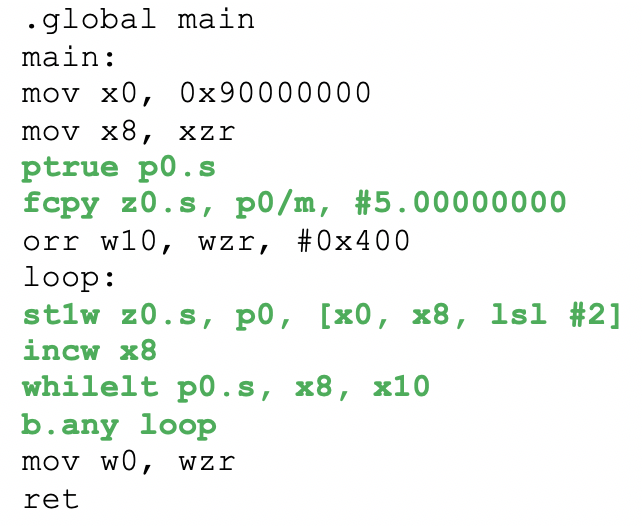
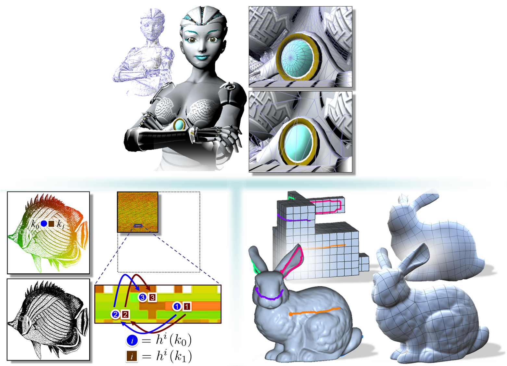
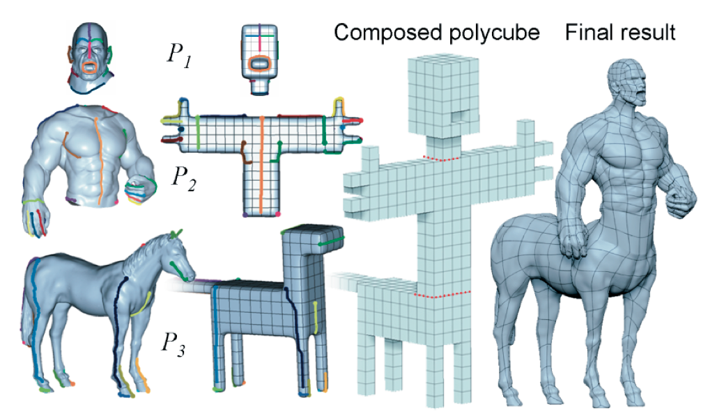
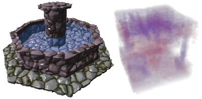
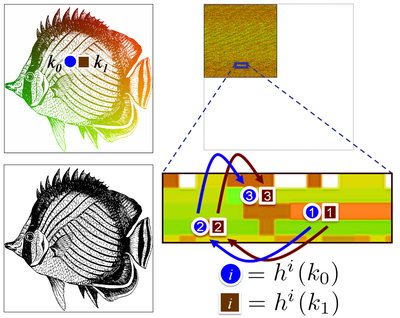
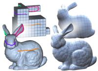
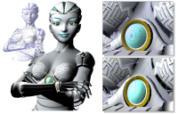
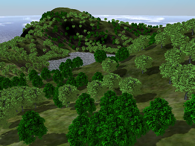
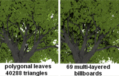
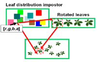

## Industry advanced product development

<pre>
I'm a staff engineer in <a href="https://www.arm.com/">Arm</a>'s Machine Learning Group working
with David Mansell and <a href="https://www.linkedin.com/in/ianbratt" title="Ian Bratt">Ian Bratt</a>.

My current work involves analysing neural networks of future use-cases, 
identifying the most relevant operations and data patterns, 
capturing key insights with data science techniques to advance 
real-world performance of <a href="https://www.arm.com">Arm</a>'s new software and hardware 
solutions.

Between 2016-2017 I worked in <a href="https://www.arm.com/">Arm</a>'s Architecture and Technology 
Group, as member of the Intelligent Machines Future System Design 
team, working with <a href="https://uk.linkedin.com/in/paulshughes">Paul Hughes</a> analysing and prototyping 
computer vision and ML subsystems for ADAS.

In 2012 I joined <a href="https://www.arm.com/">Arm</a>'s Processor Division working in system architecture 
and heterogeneous computing projects with <a href="https://uk.linkedin.com/in/charles-garc%C3%ADa-tobin-0374071">Charles Garcia-Tobin</a> 
and <a href="https://www.linkedin.com/in/jason-parker-1548aa1/">Jason Parker</a>.
</pre>

## Academic research
<pre>
I have a Ph. D. in Computer Science from <a href="https://www.udg.edu/en/?_ga=2.210128597.1782169398.1547342987-753952721.1547342987">University of Girona</a>.

My research concerned with parallel efficient data structures for data 
visualization, geometric modeling, image-based data structures
and ray-tracing. 

My work explored practical applications in a variety of areas in computer 
graphics, including real-time tree rendering, GPU efficient 
data-structures for geometric and texturing, and more recently 
dynamic parallel data-structures for ray-tracing and general-purpose 
GPU applications.

In 2011 I did a doctorate research internship in <a href="http://alice.loria.fr">ALICE Project-Team</a>
(<a href="https://www.inria.fr/en/centre/nancy">INRIA Nancy</a>), collaborating with <a href="http://www.antexel.com/sylefeb/research">Dr. Sylvain Lefebrve</a>.

In 2007 I started my Phd. in Computer Graphics joining the 
<a href="http://ggg.udg.edu/">GGG research group</a>, under the supervision of <a href="http://ima.udg.edu/~dagush/">Dr. Gustavo Patow</a>.

In 2005 I did a research internship at Technical University of Budapest
<a href="">Computer Graphics Research Group</a> collaborating with 
<a href="http://www.fsz.bme.hu/~szirmay/szirmay.html">Prof. Laszlo Szirmay-Kalos</a>.

I was introduced in the Computer Graphics field advised 
by <a href="http://ima.udg.edu/~mateu/">Prof. Mateu Sbert</a>.
</pre>

## Selected industry projects

### Automotive ADAS subsystems and use-cases

{:width="128px"} Modeling and prototyping 

### Exploring new AArch64 ISA extensions (SVE)

{:width="128px"} Prototyping and analysing the impact of new <a href="https://community.arm.com/tools/hpc/b/hpc/posts/technology-update-the-scalable-vector-extension-sve-for-the-armv8-a-architecture">SVE (Scalable Vector Extension)</a> instruction set in computer vision workloads.
Exploiting as much data-level parallelism as possible for new instructions with vector lengths that scale from 128 to 2048 bits.

### GPU coherency and heterogeneous computing

{:width="128px"} Modelling, early protytiping low-level software, and analysing heterogeneous compute use-cases to explore <a href="https://community.arm.com/processors/b/blog/posts/exploring-how-cache-coherency-accelerates-heterogeneous-compute">Shared Virtual Memory (SVM)</a> features between different type of processors (CPU & GPU) enabling sharing data, as simply as passing a pointer, which massively simplifies the software, more power efficient and higher performance than software managed mechanism.

## Selected publications

#### Parallel spatial data structures for interactive rendering
{:width="128px"} PhD Thesis, October 2012 <a href="https://www.tdx.cat/bitstream/handle/10803/107998/tigf.pdf?sequence=8&isAllowed=y">[pdf]</a>

 Advances in graphic processing units (GPUs) introduce new parallel architectures with many processor cores in single computing devices. Graphic algorithms and data structures should be adapted to take advantage of the specific aspects of these current and future parallel many-core architectures -- as standard graphics data structures for single or multiple CPUs or fixed-function GPUs are not scalable and flexible enough to do so. Thus, the problem of defining parallel- friendly data structures that can be efficiently created, updated, and accessed is still an ongoing research challenge.

The context of computer graphics is closely related to spatial data, usually defined by points, lines, rectangles, regions, surfaces, and volumes. The representation of such data has always played a crucial role in many applications. More imporatantly, quite often it is crucial that for data be accessed efficiently to improve algorithmic speed. As an example, irregular spatial data should be fitted or resampled into regular domains in order to support efficient parallel evaluation in modern GPUs. These regular spatial data structures allow original samples to be collected and queried in parallel very efficiently. The main question explored in this thesis is how to define novel parallel random-access data structures for surface and image spatial data with efficient construction, storage, and query memory access patterns.

In order to address this question, representations for shape detail mapping over coarse geometries in real-time applications are explored. The key idea is to create a mapping of the input spatial data on a coarse lattice in which each cell contains a local description of shape and shading information for rendering this region of the domain. This low-bandwidth localized memory access pattern is increasingly advantageous in many-core architectures and crucial to provide a high rendering speed.

Our main contribution is a set of parallel-efficient methods to evaluate irregular, sparse or even implicit geometries and textures in different applications: a method to decouple shape and shading details from high-resolution meshes, mapping them interactively onto lower resolution simpler domains; an editable framework to map high-resolution meshes to simpler cube-based domains, generating a parallel-friendly quad-based representation; a new parallel hashing scheme compacting spatial data with high load factors, which has the unique advantage of exploiting spatial coherence in input data and access patterns. 

&nbsp;

#### Interactive Applications for Sketch-Based Editable Polycube Map
{:width="128px"} IEEE Transactions on Visualization and Computer Graphics, (Volume:19, Issue: 7, July 2013); Ismael Garcia, Jiazhi Xia, Ying He, Shi-Qing Xin, Gustavo Patow <a href="https://ieeexplore.ieee.org/document/6361388">[pdf]</a> 

In this paper we propose a sketch-based editable polycube mapping method that, given a general mesh and a simple polycube that coarsely resembles the shape of the object, plus sketched features indicating relevant correspondences between the two, provides a uniform, regular and user-controllable quads-only mesh that can be used as a basis structure for subdivision. Large scale models with complex geometry and topology can be processed efficiently with simple, intuitive operations. We show that the simple, intuitive nature of the polycube map is a substantial advantage from the point of view of the interface by demonstrating a series of applications, including kit-basing, shape morphing, painting over the parameterization domain, and GPU-friendly tessellated subdivision displacement, where the user is also able to control the number of patches in the base mesh by the construction of the base polycube.

&nbsp;

#### A Runtime Cache for Interactive Procedural Modeling
{:width="128px"} SMI 2012: Shape Modeling International, Computer & Graphics; Tim Reiner, Sylvain Lefebvre, Lorenz Diener, Ismael Garcia, Bruno Jobard, Carsten Dachsbacher <a href="http://ggg.udg.edu/publicacions/UsersWebs/hashcache_smi2012/">[project page]</a>
 

We present an efficient runtime cache to accelerate the display of procedurally displaced and textured implicit surfaces, exploiting spatio-temporal coherence between consecutive frames. We cache evaluations of implicit textures covering a conceptually infinite space. Rotating objects, zooming onto surfaces, and locally deforming shapes now requires minor cache updates per frame and benefits from mostly cached values, avoiding expensive re-evaluations. A novel parallel hashing scheme supports arbitrarily large data records and allows for an automated deletion policy: new information may evict information no longer required from the cache, resulting in an efficient usage. This sets our solution apart from previous caching techniques, which do not dynamically adapt to view changes and interactive shape modifications. We provide a thorough analysis on cache behavior for different procedural noise functions to displace implicit base shapes, during typical modeling operations. 

&nbsp;

#### Coherent parallel hashing
{:width="128px"} ACM Transactions on Graphics  
Proceedings of SIGGRAPH Asia, Vol. 30(6), 2011, Ismael Garcia, Sylvain Lefebvre, Samuel Hornus, Anass Lasram <a href="http://ggg.udg.edu/publicacions/UsersWebs/cohash_siga2011/index.shtml">[project page]</a>

Recent spatial hashing schemes hash millions of keys in parallel, compacting sparse spatial data in small hash tables while still allowing for fast access from the GPU. Unfortunately, available schemes suffer from two drawbacks: Multiple runs of the construction process are often required before success, and the random nature of the hash functions decreases access performance. We introduce a new parallel hashing scheme which reaches high load factor with a very low failure rate. In addition our scheme has the unique advantage to exploit coherence in the data and the access patterns for faster performance. Compared to existing approaches, it exhibits much greater locality of memory accesses and consistent execution paths within groups of threads. This is especially well suited to Computer Graphics applications, where spatial coherence is common. In absence of coherence our scheme performs similarly to previous methods, but does not suffer from construction failures. Our scheme is based on the Robin Hood scheme modified to quickly abort queries of keys that are not in the table, and to preserve coherence. We demonstrate our scheme on a variety of data sets. We analyze construction and access performance, as well as cache and threads behavior.

&nbsp;

#### Editable Polycube Map for GPU-based Subdivision Surfaces
{:width="128px"} I3D 2011: Proceedings of Symposium on Interactive 3D Graphics &amp; Games; Jiazhi Xia, Ismael Garcia, Ying He, Shi-Qing Xin, Gustavo Patow <a href="http://ggg.udg.edu/publicacions/UsersWebs/igarcia_epcm_i3d2011/index.shtml">[project page]</a>

In this paper we propose an editable polycube mapping method that, given an arbitrary high-resolution polygonal mesh and a simple polycube representation plus optional sketched features indicating relevant correspondences between the two, provides a uniform, regular and artist-controllable quads-only mesh with a parameterized subdivision scheme. The method introduces a global parameterization, based on a divide and conquer strategy, which allows to create polycube-maps with a much smaller number of patches, and gives the user much more control over the quality of the induced subdivision surface. All this makes it a practical method for real-time rendering on modern hardware (e.g. OGL 4.1 and D3D11 tessellation hardware). By sketching these correspondence features, processing large-scale models with complex geometry and topology is now feasible. This is crucial for obtaining watertight displaced Catmull-Clark subdivision surfaces and high-quality texturing on real-time applications.

&nbsp;

#### IGT: Inverse Geometric Textures
{:width="128px"} ACM Transactions on Graphics, Proceedings of SIGGRAPH Asia, Vol. 27(5), 2008; Ismael Garcia, Gustavo Patow  
<a href="http://ggg.udg.edu/publicacions/UsersWebs/igarcia_igt_siga2008/">[project page]</a>

Preserving details from a high resolution reference model onto lower resolution models is a complex, and sometimes daunting, task as manual intervention is required to correct texture misplacements. Inverse Geometric Textures (IGT) is a parameterization independent texturing technique that allows preservation of texture details from a high resolution reference model onto lower resolutions, generated with a given simplification method. IGT uses a parameterization defined on the reference model to generate an inversely parameterized texture that stores, for each texel, a list of all triangles that mapped onto it. This way, for any valid texture coordinate, IGT can know the point and the triangle of the detailed model that was projected, allowing application of details from the reference model onto the fragment from the low-resolution model. IGT is encoded in compact data structures and can be evaluated quickly. Furthermore, the high resolution model can have its own independent, secondary parameterization, so that no additional effort is required to directly use artist-designed content. 

&nbsp;

#### Generation and interactive visualization of 3D vegetation
{:width="128px"} Master thesis in Computing, 2007; from the University of Girona and the UPC Barcelona Tech; advised by Gustavo Patow and Mateu Sbert  <a href="http://www.gametools.org/archives/publications/mastertesi_isma.pdf">[pdf]</a>

#### Multi-layered indirect texturing for tree rendering
{:width="128px"} Eurographics Workshop on Natural Phenomena 2007; Ismael Garcia, Gustavo Patow, Laszlo Szirmay-Kalos, Mateu Sbert  
<a href="http://ggg.udg.edu/publicacions/UsersWebs/igarcia_tree_np2007/">[project page]</a>

This paper presents a technique to render in real time complex trees using billboard clouds as an impostor simplification for the original polygonal tree, combined with a new texture-based representation for the foliage. The technique provides several new contributions with respect to previous approaches. The new algorithm allows progressive level of detail both at the geometric and at the shader levels. It also preserves the parallax effects of the original polygonal model keeping leaf positions, orientations, and preserving the overlapping of the leaves as seen from any view point. In addition, the texture-based representation provides high-definition close views without introducing high memory requeriments. We adapted a realistic lighting model with soft shadows and a global illumination precomputation, allowing to render highly complex scenes with thousands of trees in real time. 

&nbsp;

<!--
#### Tree rendering with billboard clouds
{:width="128px"} Third Hungarian Conference on Computer Graphics and Geometry, 2005; Ismael Garcia, Mateu Sbert, Laszlo Szirmay-Kalos  

This paper presents a method to render complex trees on high frame rates while providing accurate occlusion and parallax effects. Based on the recognition that a planar billboard is accurate if the represented polygon is in its plane, we find a billboard for each of those groups of tree leaves that lie approximately in the same plane. The tree is thus represented by a set of billboards, called billboard cloud. The billboards are built automatically by a clustering algorithm. Unlike classical billboards, the billboards of a billboard cloud are not rotated when the camera moves, thus the expected occlusion and parallax effects are provided. On the other hand, this approach allows the replacement of a large number of leaves by a single semi-transparent quadrilateral, which considerably improvesnthe rendering performance. A billboard cloud well represents the tree from any direction and provides accurate depth values, thus the method is also good for shadow, obscurances, and indirect illumination computation. In order to provide high quality results even if the observer gets close to the tree, we also propose a novel approach to encode textures representing the billboards. This approach is called indirect texturing and generates very high resolution textures on the fly while requiring just moderate amount of texture memory.

&nbsp;
-->

#### Leaf cluster impostors for tree rendering with parallax
{:width="128px"} Short Paper of Eurographics (Dublin, Ireland), pp. 69-72, 2005; Ismael Garcia, Mateu Sbert, Laszlo Szirmay-Kalos  

This paper presents a simple method to render complex trees on high frame rates while maintaining parallax effects. Based on the recognition that a planar impostor is accurate if the represented polygon is in its plane, we find an impostor for each of those groups of tree leaves that lie approximately in the same plane. The groups are built automatically by a clustering algorithm. Unlike billboards, these impostors are not rotated when the camera moves, thus the expected parallax effects are provided. On the other hand, clustering allows the replacement of a large number of leaves by a single semi-transparent quadrilateral, which improves rendering time considerably. Our impostors well represent the tree from any direction and provide accurate depth values, thus the method is also good for shadow computation.

&nbsp;

## Academic teaching  

#### From 2010 to 2011	Multimedia  and computing technologies,  
Technical Computer Engineering  (University  of Girona)  
Teaching assistant  

#### From 2009 to 2010	Multimedia  and computing technologies,  
Technical Computer Engineering  (University  of Girona)  
Teaching assistant  

#### From 2008 to 2009	Information Technologies,  
Enviromental Science (University  of Girona)  
Teaching assistant  

#### From 2007 to 2008	Effective audio-visual presentations, 
Law (University of Girona)  
Teaching assistant  

#### From 2007 to 2008	Information Technologies,  
Enviromental Science (University  of Girona)  
Teaching assistant  

## Conference talks

<!-- #### 2019: Global Engineering Conference
Arm internal engineering conference -->
  
#### 2018: Data + Insights
Arm internal Data Science Conference
<!--  Improving ML solutions with Data Science --> 

#### 2011: Event Lab Talk
Parallel computing for data processing, rendering & interaction  
<a href="http://www.event-lab.org">Event Lab</a> Invited Speaker  
<a href="https://www.ub.edu/web/ub/en/?">University of Barcelona</a>
Barcelona, Spain

#### 2011:	Coherent parallel hashing
<a href="https://sa2018.siggraph.org/en/about-us/about-siggraph-asia">SIGGRAPH Asia 2011</a>  
Hong Kong, China  

#### 2011:       Editable Polycube Map for GPU-based Subdivision Surfaces
<a href="http://graphics.cs.umass.edu/i3d2011/program.php">Symposium on Interactive 3D Graphics and Games 2011</a>  
San Francisco, USA  
 
#### 2008:	IGT: Inverse Geometric Textures
<a href="https://sa2018.siggraph.org/en/about-us/about-siggraph-asia">SIGGRAPH Asia 2011</a>  
Singapure, Singapore  

#### 2007:	Multi-layered indirect texturing for tree rendering
<a href="http://dcgi.fel.cvut.cz/cgg/egwnp07/">Eurographics Workshop on Natural Phenomena 2007</a>    
Prague, Czech Republic  

#### 2005:	Leaf cluster impostors for tree rendering with parallax
<a href="http://isg.cs.tcd.ie/eg2005/">Eurographics 2005</a>   
Dublin, Ireland  

## Supervised Bachelor Students:

#### 2017    Gershom Akoli Agim
Deep Neural Networks on Arm Cortex-A CPUs:   
Analysis of CPU Inference on Vision workloads  
MEng Electrical & Electronic Engineering Hons Project  
<a href="https://www.hw.ac.uk/">Heriot-Watt University</a>

#### 2016    Jan-Peter Larsson 
3D Reconstruction using Stereo Matching Techniques on Scalable Vector Processors  
MEng Electrical Hons Project  
<a href="https://www.ed.ac.uk/home">Edinburgh University</a>
 
#### 2011	Enrique Nuzete
Interactive polycubemap editor  
BEng Project, Technical Computer Engineering   
<a href="https://www.udg.edu/ca/study-at-the-udg">University of Girona</a>   

#### 2011    Tania Mendes
Modelling and visualization of skeleton-based animations  
BEng Project, Technical Computer Engineering   
<a href="https://www.udg.edu/ca/study-at-the-udg">University of Girona</a>  

#### 2007    Verena Skuk
Procedural modelling and rendering of vegetation  
Student Research Project  
<a href="https://www.udg.edu/ca/study-at-the-udg">University of Girona</a>  

#### 2007    Isaac Moles
Real-time rendering of large forest  
BEng Project, Technical Computer Engineering   
<a href="https://www.udg.edu/ca/study-at-the-udg">University of Girona</a>  

## Other professional activities

### Program Committee Member	 
#### CGVCVIP  Computer  Graphics, Visualization, Computer  Vision &  Image Processing
2012
<a href="http://www.iadisportal.org/digital-library/iadis-international-conference-computer-graphics-visualization-computer-vision-and-image-processing-2012-part-of-mccsis-2012">IADIS International Conference Computer Graphics Visualization and Image Processing</a>  

#### CEIG: 
<a href="http://ceig2015.uji.es">CEIG 2015</a>  

### Reviewer
 
#### Siggraph Asia: 
<a href="https://sa2014.siggraph.org/en">Siggraph Asia 2014</a>  
Technical papers reviewer  
<a href="https://sa2015.siggraph.org/en">Siggraph Asia 2015</a>  
Technical papers reviewer  

#### CGI Computer Graphics International: 
<a href="https://blogs.bournemouth.ac.uk/cgi2012">CGI 2012</a>  
Technical papers reviewer  
 
#### I3D Interactive 3D Graphics and Games: 
<a href="https://i3dsymposium.github.io/2012">I3D 2012</a>  
Technical papers reviewer

#### EG Eurographics:
<a href="https://www.ics.forth.gr/eg2008/home.php">EG 2008</a>  
Technical papers reviewer  

<a href="http://eg2013.udg.edu">EG 2013</a>    
Technical papers reviewer  

#### Computer Animation and Virtual Worlds Journal: 
2014 <a href="https://onlinelibrary.wiley.com/journal/1546427x">Computer Animation and Virtual Worlds Journal</a>   
Technical papers reviewer

#### CEIG Congreso Español de Informática Gráfica:
2015 <a href="http://ceig2015.uji.es">CEIG 2015</a>  
Technical papers reviewer  
 
2009 <a href="https://dblp.org/db/conf/ceig/ceig2009.html">CEIG 2009</a>  
Technical papers reviewer  

2008 <a href="http://www.lsi.upc.edu/events/ceig">CEIG 2008</a>  
Technical papers reviewer  

### Conference Organizer	
2009 <a href="http://iiia.udg.edu/EGSR2009/">Eurographics Symposium on Rendering, EGSR</a>  
Girona, Spain  
Local organizer  

### Industry research collaborations	
2010 GPU Mesh Processing tools  
NVIDIA Mutual Non-Disclosure Agreement 

## Education and training  

#### 2007 – 2012	Ph.D. in Computer  Science
Dissertation: Parallel spatial data structures for interactive rendering  
BR PhD Fellowship from the <a href="https://www.udg.edu/ca/study-at-the-udg">University of Girona</a>

#### 2006 – 2007	Master in computing
From the <a href="https://www.udg.edu/ca/study-at-the-udg">University of Girona</a>, and the <a href="https://www.upc.edu/en?set_language=en">UPC Barcelona Tech</a>  

#### 2003 – 2006	Computer Engineering
<a href="https://www.udg.edu/ca/study-at-the-udg">University of Girona</a>, Spain  

#### 1999 – 2003	Technical Computer Engineering 
<a href="https://www.udg.edu/ca/study-at-the-udg">University of Girona</a>, Spain  

## Honors and awards
 
#### 2007	Generation and real-time visualization of 3D vegetation
Best UdG-CS project award 2006/2007  
<a href="https://www.udg.edu/ca/study-at-the-udg">University of Girona</a>, Spain  
Patronat Award 12th Edition winner  
Supervised by Gustavo Patow and Mateu Sbert  

## Academic experience

#### From June 2011 to December 2013	Advances in virtual reality for cutting edge applications
<a href="http://ima.udg.edu/~sellares/Tin2010/Tin2010.htm">Spanish Ministry of Science and Technology Project (TIN2010-20590-C02-02)</a>  
Research developer  
 
#### From November 2007 to July 2010	CALBaD: Computer Aided Light Based Design  
<a href="http://www.ia.urjc.es/jspTIN2010/informesPDF/TIN2007-67120.pdf">Spanish Ministry of Science and Technology Project (TIN2007-67120)</a>  
Research developer  

#### From October 2009 to December 2009	Research intership - INRIA Nancy (France), Alice project-team
Phd thesis research intership under supervision of Dr.Sylvain Lefebvre  
Mobility grant TME2008-00961 from <a href="http://alice.loria.fr/">Alice project-team</a>  
<a href="https://www.inria.fr/en/centre/nancy">INRIA Nancy</a> France  
Reserch developer  

#### From May 2007 to May 2011	PhD research fellowship BR
<a href="https://www.udg.edu/ca/study-at-the-udg">University of Girona</a>  
Research PhD student    

#### From September 2004 to April 2007	Gametools Project
<a href="http://ima.udg.edu/~sellares/Tin2010/Tin2010.htm">European Union Project (IST-2-004363)</a>  
Research developer  

#### From February 2010 to April 2010	Research intership - INRIA Nancy (France), Alice project-team
Phd thesis research intership under supervision of <a href="http://www.antexel.com/sylefeb/research">Dr.Sylvain Lefebvre</a>, INRIA contract <a href="http://alice.loria.fr/">Alice project-team</a>  
<a href="https://www.inria.fr/en/centre/nancy">INRIA Nancy</a>, France
Research developer

#### From February 2005 to May 2005	Research undergraduate intership
Undergraduate final project under supervision of <a href="http://www.fsz.bme.hu/~szirmay/szirmay.html">Prof.László Szirmay-Kalos</a>
<a href="https://www.bme.hu/?language=en">Technical University of Budapest</a>  
Erasmus programme grant  
Research developer  

<!--
## Conferences attendance

#### 2017 Implementing Machine Vision with FPGA and SoC platforms Conference
https://nmi.org.uk/event/fpga-network-implementing-machine-vision-with-fpga-and-soc-platforms/

#### 2018 Arm Research Summit
https://www.arm.com/company/events/research-summit

#### 2013 Global Engineering Conference
Arms global engineering conference

#### International Workshop on OpenCL, 
IWOCL 2013 https://www.iwocl.org/2013-presentations/
IWOCL 2014 https://www.iwocl.org/iwocl-2014/agenda-and-slides/
-->

## Previous experience

#### From June 2003 to March 2006	El Baúl S.A. – Grupo editorial el baúl
Redesign and implementation  of a corporative application to the web management of adverts  
<a href="http://www.elbaul.es">elbaul.es</a>  
Web developer

#### From July 2002 to December 2002	Institut d’Informàtica i Aplicacions, Universitat  de Girona
Review and performance analysis of of the Sony’s Playstation 2 Linux Development Kit.
Project number TIC2001-2416-C03-01, financed by the Spanish Ministery of Science and Technology
<a href="http://gplsi.dlsi.ua.es/congresos/mcyt03/pdf/tic/TIC2001-2416-C03.pdf">[pdf]</a>  
Software developer  

#### From June 2000 to September 2000	Igm Web S.L.
Design and implementation of several corporative websites.  
<a href="http://www.igmweb.com/indexcat.html">Igm Web S.L.</a>  
Web developer

#### From June 1999 to September 1999	Kripton Networks
Writing technical reviews of videogames as a freelance web journalist.
<a href="http://www.iespana.es/">Iespana/Informatica</a>  
Web technical writer

