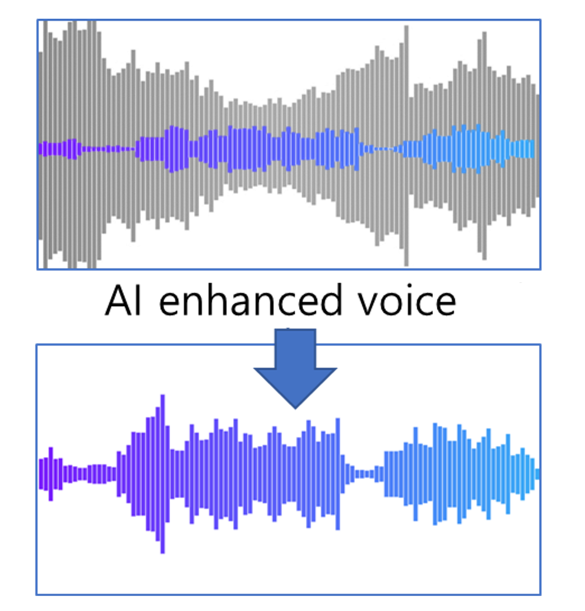
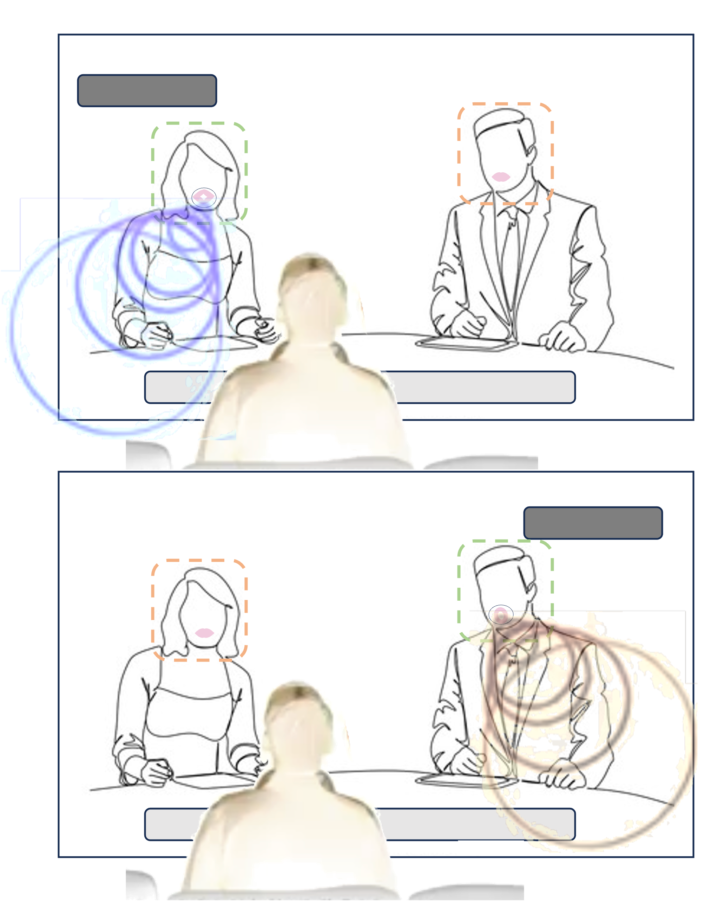
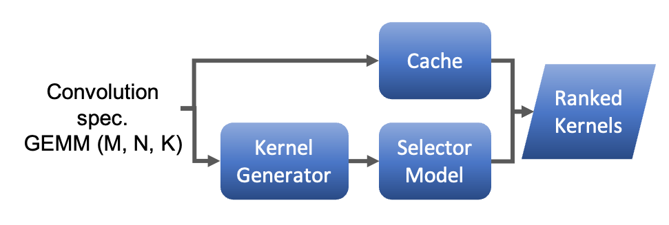
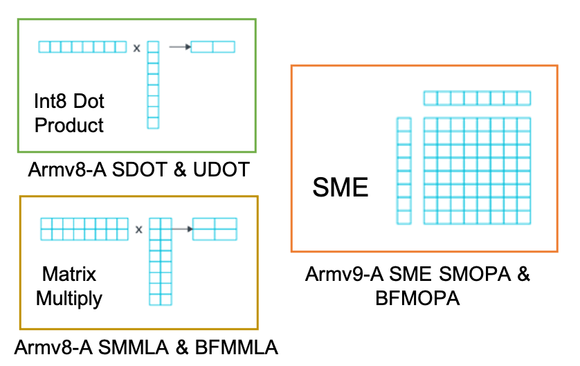
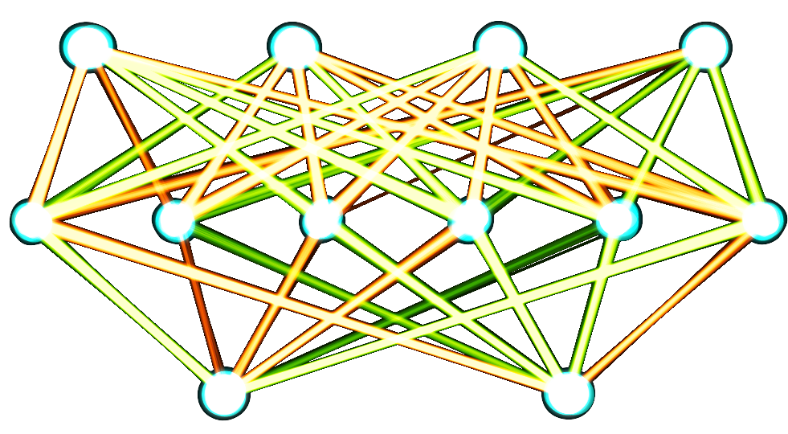
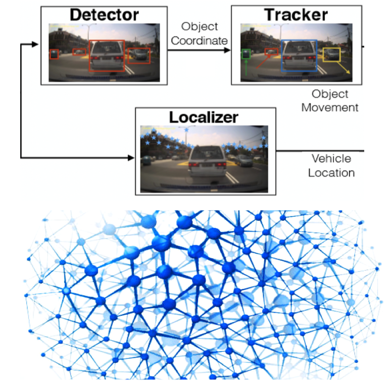

---
layout: default
---  

&nbsp;
&nbsp;


 



## Personal statement


This is the personal statement for MSFT

  
This is text for AMZN...
  
    
This is text for DPMND...
    
      
This is text for AZN...
      
        
I am an engineer at heart with close links and passion for high performance computing, graphics, visual perception, and AI.
I have always been working in research and senior applied research positions, collaborating with local and remote teams, and leading small-to-medium sized technical teams. 

More recently, prototyping, and analyzing how subsystems might integrate new research features, closing the bridge between research and future products. I enjoy applying mathematical and computational approaches to understand complex systems, always open and eager to learn new things, and specially interested to work with multidisciplinary teams.
        
          

I am an engineer at heart, with passion for AI, high performance computing, system architecture, real-time processing, audio-visual perception, and data analytics. I have over 8 years of experience in system architecture and software performance analysis. My expertise includes an in-depth understanding of computer architecture of IP processors, from early-stage software models up to deployment in RTL, FPGA, and silicon. I have explored and challenged the limits of interconnects, CPUs/GPUs/NPUs through use-cases characterization, tracing and distilling the key compute and data patterns, reducing them down to manageable low-level benchmarks for performance analysis. 



&nbsp;
&nbsp;
&nbsp;
&nbsp;
&nbsp;


I have spent all my career in research and senior applied research roles, working flexibly as main individual contributor, leading teams and collaborating with cross-functional local and remote teams, to define and implement non-intrusive, highly accurate tools for characterizing and modeling complex workloads, ensuring precise workload representation and clear presentation of the captured insights.

My skills include planning and implementing tool systems for architectural exploration and software/hardware co-optimization. I design and develop strategies for software/hardware co-optimization and lead coordination with other software, hardware and architects' stakeholders, to achieve optimal performance of new software and hardware components for next-generation processors.



&nbsp;
&nbsp;
&nbsp;
&nbsp;
&nbsp;


In last role, I gained significant hands-on expertise in deploying large language models (LLMs) on accelerated services and embedded devices. While details are confidential with previous employer project, my primary focus has been fine-tuning and optimizing pre-trained models to meet stringent latency and performance requirements for real-time services. For instance, I successfully slimmed recurrent neural networks (RNNs) and transformers by up to 80% by applying quantization, pruning, knowledge distillation and other compression techniques without severely impacting their accuracy. The results were applied to enhance accessibility of video content, with descriptive captions and subtitles or voiceovers generated automatically for media content.

 

I have strong proficiency in C++ and Python, with experience prototyping new features from firmware, to operating system driver level or user-space applications for key instrumentation. I can debug performance or functional problems at any stage of the software-hardware co-development and optimization process: from user-space to architectural and microarchitectural levels in simulators, emulators and even occasionally up to waveform-level when required. Then, I am able to make performance projections from individual components or full SoC simulators and tools such as Gem5, QEMU, and DynamoRIO. 



&nbsp;
&nbsp;
&nbsp;
&nbsp;
&nbsp;


My passion for analysis and performance optimization energise me to have a high degree of initiative and confident problem-solving abilities, which have earned me recognition and awards in projects spanning from proof-of-concept to deployment in production, introducing novel data analysis and AI techniques to create tools for performance prediction, and finally presenting the main achievements in internal and external conferences and events.

I speak English, Spanish and Catalan fluently and Korean at beginner's level. I genuinely enjoy applying mathematical and computational approaches to decode complex systems. Eager to continuously expand my knowledge, I am especially energized by opportunities to collaborate with multidisciplinary teams on cutting-edge challenges. My engineering foundation paired with my drive to learn makes me adept at breaking down complex technical problems and assessing potential innovations that balance creativity with pragmatic and scalable solutions. 

 

<!--
I have experience over 8 years of system architecture expertise, and SW performance analysis.
I have understanding of computer architecture and microarchitectures from prototype/early-stage system models to deployment in final RTL, FPGA, silicon and softare.
I have experience challenging the limits of interconnect, CPUs/GPUs/NPUs from use-cases to low-level performance analysis.
I have passion for analysis and improvement.
Capable of working both in teams and independently.
Demonstrated high degree of initiative and confident problem solved (awards)
I have experience working on pre-silicon platfomrs from models, RTL, simulation, emulation and FPGA.
I have experience using data analysis and AI create tools that aims to help us analyse and predict performance of different
I have experience in many type of use-cases running on CPU, GPU and NPUs, from AI, Computer Vision, Computer Graphics, Speech Recognition.
I have profound background in workload modeling:
I have experience of defining methodologies of tracing and reducition of large use-case applications to speedup simulation and make performance projection to provide insights to s/w and h/w architects
I can plan and implement tool systems for architectural exploration and performance analysis, driving software/hardware vertical integration and planiong software/hardware co-optimization for next generation features in processors.
I have a strong CPU/GPU/NPU architecture and workload extraction as a good grasp of compiler, binary analysis and software/hardware co-optimization.
I have experience in investigation of cutting-edge, high-performance computing from servers, to mobile and embeded CPU and SoC architectures, contributiong vital data support for crucial decision-making processes.
I have experience designing and executing implementations of relevant tool systems for the exploration of architecture and the analysis of performance.
I have experience developing strategies for software/hardware co-optimization features and lead the integration of software and hardware components for th enext generation processors.
I have experinece constructing non-intrusive, highly accurate tools for characterizing and modelling complex workloads, ensuring precise workload representation.
I have experience analysing and extracting the distinctive features of real-world scenario workloads, delivering essential insights to the architecture and development teams.
I have experience making performance projections and architectural exploration using SoC simulators
I have experience using performance simulators including fast models and cycle accurate models like SystemC, Gem5, QEMU, or DynamoRIO.
I have strong skills in languages such as C++ and Pythob. And I have experience prototyping new features at firmware and and OS driver levels, or user-space applicatoins addressing key instrumentation to gather key insights at any stage of the softwware-hardware co-development and optimization.
I have experience debugging performance or functional problems from user-space, up to architectural and micro-architectural level in simulators, and occasional up to waveform-level when required.
-->
          
            

When I discovered Hugging Face was seeking a machine learning expert to drive advancements in core speech and language capabilities to expand accessibility for all, I was captivated. Leveraging over 2 years’ of experience architecting and productionizing speech recognition systems - including at industry-leading AI labs - to now lead cutting edge textual and spoken language interfaces towards equitable open availability deeply resonates. I have worked 6 years in applied research AI projects, and more than  10 years in applied resarch of high-performance computing with GPUs.

I am an engineer at heart, with passion for AI, high performance computing, real-time processing, audio-visual perception, and data analytics. My experience spans from firmware development to high performance GPU computing and CPU, NPU or DSP processing in embedded systems. I have spent my career in research and senior applied research roles, leading and collaborating cross-functional local and remote teams. Recently, I have been leading applied research teams focused on prototyping and analyzing how to integrate new research features into future products, serving as a bridge between research concepts and commercial solutions.

I speak English, Spanish and Catalan fluently and Korean at beginner's level. I genuinely enjoy applying mathematical and computational approaches to decode complex systems. Eager to continuously expand my knowledge, I am especially energized by opportunities to collaborate with multidisciplinary teams on cutting-edge challenges. My engineering foundation paired with my drive to learn makes me adept at breaking down complex technical problems and assessing potential innovations that balance creativity with pragmatic and scalable solutions.

I have expertise optimizing large automatic speech recognition (ASR) models (100s of millions of parameters) for on-device deployment by making them 20-5% smaller while retaining most of their accuracy. While details are confidential due to an ongoing employer project, I gained valuable skills - including knowledge distillation, architecture adaptation, mixed quantization, and optimizations for memory, bandwidth and latency - to meet real-time performance requirements on resource-constrained hardware running many intensive tasks concurrently. The equivalent public ASR models I applied these techniques to are Whisper and HuBERT. My key achievement was successfully generating optimized ASR models that meet strict latency, quality and performance requirements for on-device NPUs. I have also explored the integration of ASRs with speaker diarization and speech-to-speech translation, as a service for streaming content providers.

In my current role, I have gained significant hands-on expertise in deploying large language models (LLMs) on accelerated services and embedded devices. While details are confidential due to an ongoing employer project, my primary focus has been fine-tuning and optimizing pre-trained models to meet stringent latency and performance requirements for real-time services. For instance, I successfully slimmed recurrent neural networks (RNNs) and transformers by up to 80% by applying quantization, pruning, knowledge distillation and other compression techniques without severely impacting their accuracy. The results were applied to enhance accessibility of video content, with descriptive captions and subtitles or voiceovers generated automatically for media content.

I am deeply committed to utilizing ML to drive positive change through open research and guiding the next generation of innovators—values. I would be eager and enthusiastic to join forces with your talented community of experts pushing boundaries in NLP and Speech while ensuring these powerful tools can empower changemakers everywhere. My background (see attached CV!) at the intersection of commercial speech systems implementation and publishing open dialogue research would allow me to quickly contribute to advancing the technology further and expanding its accessibility right away. Together I am confident we could spearhead truly impactful innovations that meaningfully progress more people ahead. I would greatly welcome the opportunity to further discuss ideas on that potential with you and the team!

            
              

I am an engineer at heart, with passion for AI, high performance computing, system architecture, real-time processing, audio-visual perception, and data analytics. I have over 8 years of experience in system architecture and software performance analysis. My expertise includes an in-depth understanding of computer architecture of IP processors, from early-stage software models up to deployment in RTL, FPGA, and silicon. I have explored and challenged the limits of interconnects, CPUs/GPUs/NPUs through use-cases characterization, tracing and distilling the key compute and data patterns, reducing them down to manageable low-level benchmarks for performance analysis. 

I have spent all my career in research and senior applied research roles, working flexibly as main individual contributor, leading teams and collaborating with cross-functional local and remote teams, to define and implement non-intrusive, highly accurate tools for characterizing and modeling complex workloads, ensuring precise workload representation and clear presentation of the captured insights.

My skills include planning and implementing tool systems for architectural exploration and software/hardware co-optimization. I design and develop strategies for software/hardware co-optimization and lead coordination with other software, hardware and architects' stakeholders, to achieve optimal performance of new software and hardware components for next-generation processors.

I have strong proficiency in C++ and Python, with experience prototyping new features from firmware, to operating system driver level or user-space applications for key instrumentation. I can debug performance or functional problems at any stage of the software-hardware co-development and optimization process: from user-space to architectural and microarchitectural levels in simulators, emulators and even occasionally up to waveform-level when required. Then, I am able to make performance projections from individual components or full SoC simulators and tools such as Gem5, QEMU, and DynamoRIO. 

My passion for analysis and performance optimization energise me to have a high degree of initiative and confident problem-solving abilities, which have earned me recognition and awards in projects spanning from proof-of-concept to deployment in production, introducing novel data analysis and AI techniques to create tools for performance prediction, and finally presenting the main achievements in internal and external conferences and events.

I speak English, Spanish and Catalan fluently and Korean at beginner's level. I genuinely enjoy applying mathematical and computational approaches to decode complex systems. Eager to continuously expand my knowledge, I am especially energized by opportunities to collaborate with multidisciplinary teams on cutting-edge challenges. My engineering foundation paired with my drive to learn makes me adept at breaking down complex technical problems and assessing potential innovations that balance creativity with pragmatic and scalable solutions. 

 

<!--
I have experience over 8 years of system architecture expertise, and SW performance analysis.
I have understanding of computer architecture and microarchitectures from prototype/early-stage system models to deployment in final RTL, FPGA, silicon and softare.
I have experience challenging the limits of interconnect, CPUs/GPUs/NPUs from use-cases to low-level performance analysis.
I have passion for analysis and improvement.
Capable of working both in teams and independently.
Demonstrated high degree of initiative and confident problem solved (awards)
I have experience working on pre-silicon platfomrs from models, RTL, simulation, emulation and FPGA.
I have experience using data analysis and AI create tools that aims to help us analyse and predict performance of different
I have experience in many type of use-cases running on CPU, GPU and NPUs, from AI, Computer Vision, Computer Graphics, Speech Recognition.
I have profound background in workload modeling:
I have experience of defining methodologies of tracing and reducition of large use-case applications to speedup simulation and make performance projection to provide insights to s/w and h/w architects
I can plan and implement tool systems for architectural exploration and performance analysis, driving software/hardware vertical integration and planiong software/hardware co-optimization for next generation features in processors.
I have a strong CPU/GPU/NPU architecture and workload extraction as a good grasp of compiler, binary analysis and software/hardware co-optimization.
I have experience in investigation of cutting-edge, high-performance computing from servers, to mobile and embeded CPU and SoC architectures, contributiong vital data support for crucial decision-making processes.
I have experience designing and executing implementations of relevant tool systems for the exploration of architecture and the analysis of performance.
I have experience developing strategies for software/hardware co-optimization features and lead the integration of software and hardware components for th enext generation processors.
I have experinece constructing non-intrusive, highly accurate tools for characterizing and modelling complex workloads, ensuring precise workload representation.
I have experience analysing and extracting the distinctive features of real-world scenario workloads, delivering essential insights to the architecture and development teams.
I have experience making performance projections and architectural exploration using SoC simulators
I have experience using performance simulators including fast models and cycle accurate models like SystemC, Gem5, QEMU, or DynamoRIO.
I have strong skills in languages such as C++ and Pythob. And I have experience prototyping new features at firmware and and OS driver levels, or user-space applicatoins addressing key instrumentation to gather key insights at any stage of the softwware-hardware co-development and optimization.
I have experience debugging performance or functional problems from user-space, up to architectural and micro-architectural level in simulators, and occasional up to waveform-level when required.
-->
	      
	        

I am an engineer at heart, with passion for AI, high performance computing, real-time processing, audio-visual perception, and data analytics. Leveraging over 10 years’ of experience architecting and productionizing high performance computing, computer vision and speech recognition systems. Last 6 years, in industry-leading AI labs, working in AI applied research projects. My experience spans from firmware development to high performance GPU computing and CPU, NPU or DSP processing in embedded systems. 

I have spent all my career in research and senior applied research roles, leading and collaborating cross-functional local and remote teams. Recently, I have been leading applied research teams focused on prototyping and analyzing how to integrate new research features into future products, serving as a bridge between research concepts and commercial solutions.

I speak English, Spanish and Catalan fluently and Korean at beginner's level. I genuinely enjoy applying mathematical and computational approaches to decode complex systems. Eager to continuously expand my knowledge, I am especially energized by opportunities to collaborate with multidisciplinary teams on cutting-edge challenges. My engineering foundation paired with my drive to learn makes me adept at breaking down complex technical problems and assessing potential innovations that balance creativity with pragmatic and scalable solutions. 

 
 

I have expertise optimizing large automatic speech recognition (ASR) models (100s of millions of parameters) for on-device deployment by making them 20-5% smaller while retaining most of their accuracy. While details are confidential from previous employer project, I gained valuable skills - including knowledge distillation, architecture adaptation, mixed quantization, and optimizations for memory, bandwidth and latency - to meet real-time performance requirements on resource-constrained hardware running many intensive tasks concurrently. The equivalent public ASR models I applied these techniques to are Whisper and HuBERT. My key achievement was successfully generating optimized ASR models that meet strict latency, quality and performance requirements for on-device NPUs. I have been explored the integration of ASRs with speaker diarization and speech-to-speech translation, as a service for streaming content providers.

In last role, I gained significant hands-on expertise in deploying large language models (LLMs) on accelerated services and embedded devices. While details are confidential with previous employer project, my primary focus has been fine-tuning and optimizing pre-trained models to meet stringent latency and performance requirements for real-time services. For instance, I successfully slimmed recurrent neural networks (RNNs) and transformers by up to 80% by applying quantization, pruning, knowledge distillation and other compression techniques without severely impacting their accuracy. The results were applied to enhance accessibility of video content, with descriptive captions and subtitles or voiceovers generated automatically for media content.

 




                
                  OTHER
     	        
              
            
          
        
      
      
  


  
&nbsp;











<h3 id="apr2024-present2024-l-huawei-research-uk">
Apr.2024-Present <a href="https://www.cambridgesciencepark.co.uk/company-directory/hauwei-uk-rd-centre/">l Huawei Research UK</a>
</h3>

I am a Principal Performance Modelling Engineer in <a href="https://www.huawei.com/en/publications/huawei-research">Huawei Research</a> (<a href="https://www.cambridgesciencepark.co.uk/company-directory/hauwei-uk-rd-centre/">UK</a>), focusing on modelling and simulation of upcoming CPU and NPU processors with AI future use-cases, leading architectural studies and software/hardware co-optimization to define requirements and new innovative features of such advanced processors. 

&nbsp;




&nbsp;






## Previous Experience






<h3 id="jan2024-mar2024-l-freelance-ai-consultant">
Jan.2024-Mar.2024 <a href="https://ismaelgarcia.ai">l Freelance AI Consultant</a>
</h3>

Exploring next career steps and AI freelance consulting.

&nbsp;




&nbsp;







<h3 id="apr2022-dec2023-l-samsung-research-uk">
Apr.2022-Dec.2023 <a href="https://research.samsung.com/sruk">l Samsung Research UK</a>
</h3>

Between 2022-2023, as Tech Lead and Principal Engineer in <a href="https://research.samsung.com/">Samsung Research</a> (<a href="https://research.samsung.com/sruk">SRUK</a>), I worked with <a href="https://www.linkedin.com/in/chrisalder/" title="Chris Alder">Chris Alder</a> and <a href="https://www.linkedin.com/in/ben-duckworth-05aa8b11" tittle="Ben Duckworth">Ben Duckworth</a>, leading an On-Device AI Applied Research team and collaborated with cross-functional local and remote teams, driving on-device AI vision & speech applied research projects, focusing on ML-hardware aware solutions: frameworks and neural network models optimisation for the next generation of Samsung products; from proof-of-concepts to commercial products in fast-paced projects.

&nbsp;

<h4 id="-speech-separation-and-enhancement-2022-2023">&#x2022; Speech Separation and Enhancement (2022-2023)</h4>

 Designed and developed efficient real-time RNN architecture models that distinguish and separate the primary voice from other sounds. The key is to take advantage of Neural Processing Units to achieve <a href="https://news.samsung.com/us/ai-driven-sound-innovation-redefining-the-tv-audio-experience/">optimal sound enhancements in real-time</a>, providing deeper and greater details by analyzing content scene by scene and accentuating various audio elements including human voices, background music and sound effects in next generation products.

<h5 id="-outstanding-rd-award-for-performance--continuous-contributions-122023-results-also-presented-in-ces-2024"><a href="https://ismagarcia.github.io/me/assets/img/samsung_electronics_award_2023.png">** Outstanding R&amp;D Award for performance &amp; continuous contributions (12/2023) **</a> <a href="https://www.youtube.com/live/kwC80iGpbhY?si=fg7ZeI95bYLGzmbz&amp;t=1372">(Results also presented at CES 2024)</a></h5>

<em>Keywords</em>: Deep Neural Networks, Pytorch, Tensorflow, Jax, RNN, Transformers, Speech Processing, Speaker Source Separation, NPU: Neural Processing Units, DSP: Digital Signal Processing Units, Tizen, Real-time Processing

<h4 id="-face-and-speaker-detection-and-verification-2022-2023">&#x2022; Face and Speaker Detection & Verification (2022-2023)</h4>

 Optimized deep neural network architectures to achieve real-time faces and lips detection, from characters displayed on the screen, taking advantage of Neural Processing Units to <a href="https://www.samsung.com/au/support/tv-audio-video/object-tracking-sound-on-your-smart-tv/">automatically associate their voices with their position</a> in the image, for increased realism and immersive sound experience in next generation products. And experimental Speaker Verification for parental control use-cases

<em>Keywords</em>: Deep Neural Networks, Pytorch, Tensorflow, Object Detection, NPU: Neural Processing Units, DSP: Digital Signal Processing Units, Tizen, Real-time Processing

&nbsp;




&nbsp;



 







<h3 id="jan2018-mar2022-l-arm-machine-learning-group-architecture-and-technology">
Jan.2018-Mar.2022 <a href="https://www.arm.com">l Arm (Machine Learning Group)</a>
</h3>

Between 2018-2022, as a Principal Engineer in <a href="https://www.arm.com/">Arm</a>'s Machine Learning Group, I worked  with David Mansell and <a href="https://www.linkedin.com/in/ianbratt" title="Ian Bratt">Ian Bratt</a>, analysing neural networks of future use-cases, identifying the most relevant operations and data patterns, capturing key insights with data science techniques to advance real-world performance of <a href="https://www.arm.com">Arm</a>'s new software and hardware solutions.

&nbsp;

<h4 id="-predictive-models-for-kernels-selection-heuristics-2020-2022">&#x2022; Predictive Models for Kernel Selection Heuristics (2020-2022)</h4>

 Designed and developed innovative predictive model for CPUs & GPUs, for high-performance selection of kernels implementations of GEMM (General Matrix Multiply) and convolutions, within Machine Learning use-cases; choosing the right implementation in microseconds is crucial through fast and general heuristics.

<em>Keywords</em>: Deep Neural Networks, Tensorflow, Keras, Convolutions, General Matrix Multiply, Decision Trees, Random Forest, Classification, Regression, AutoML, Data Augmentation, Performance Analysis

<h4 id="-new-armv9-a-ml-cpu-isa-extensions-sme-2020-2022">&#x2022; New Armv9-A ML CPU ISA extensions (SME) (2020-2022)</h4>

 Investigated novel CPU architecture features called <a href="https://community.arm.com/developer/ip-products/processors/b/processors-ip-blog/posts/scalable-matrix-extension-armv9-a-architecture">SME (Scalable Matrix Extension)</a>—a new instruction set designed to optimize performance and power efficiency of AI applications. SME enables hardware-acceleration of outer product operations, for fast general matrix multiplication used AI core oeprations. Through hardware simulations and benchmarking, I demonstrated to CPU architects and hardware engineers concrete performance gains for AI applications

<em>Keywords</em>: Matrix multiplication, Outer product, Modelling, CPU Architecture, Deep Neural Network, Performance Analysis

<h4 id="-future-use-cases-and-deep-neural-networks-performance-2018-2022">&#x2022; Future Use-Cases & Deep Neural Networks Performance (2018-2022)</h4>

 Investigated deep neural networks for future use-cases, analysing them and breaking them down to distill the most relevant operations and data patterns, capturing key insights with data science techniques, to then drive new software and hardware solutions.

<em>Keywords</em>: Deep Neural Networks, Convolutions, General Matrix Multiply, Classification, Regression, LSTM, Transformers, Clustering, Ensemble Learning, Data Augmentation, Performance Analysis




&nbsp;







<h3 id="sep2012-Dec2017-l-arm-machine-learning-group-architecture-and-technology">
Sep.2012-Dec.2017 <a href="https://www.arm.com">l Arm (Architecture & Technology Group)</a>
</h3>

Between 2015-2017, I worked with <a href="https://uk.linkedin.com/in/paulshughes">Paul Hughes</a> in <a href="https://www.arm.com/">Arm</a>'s Architecture and Technology 
Group, as member of the Intelligent Machines Future System Design 
team, analysing and prototyping computer vision and ML subsystems for ADAS.

&nbsp;

<h4 id="-adas-and-computational-biology-use-cases-2016-2017">&#x2022; ADAS & Computational Biology use-cases (2016-2017)</h4>

 Analysed and prototyped machine learning subsystems for ADAS (Advanced Driver-Assistance System) and Computational Biology applications, to identify which computational patterns could be optimized with the <a href="https://community.arm.com    /tools/hpc/b/hpc/posts/technology-update-the-scalable-vector-extension-sve-for-the-armv8-a-architecture">SVE (Scalable Vector Extension)</a> instruction set.

<em>Keywords</em>: Image Segmentation, SLAM, Stereo matching, Object Detection, Graph/Network Structures, Deep Neural Networks, System Architecture, Memory management, Virtualization, Software Modelling, Performance Analysis

<h4 id="-new-armv8-a-cpu-isa-extensions-sve-2015-2016">&#x2022; New Armv8-A CPU ISA extensions (SVE) (2015-2016)</h4>

 Investigated the impact of <a href="https://community.arm.com/tools/hpc/b/hpc/posts/technology-update-the-scalable-vector-extension-sve-for-the-armv8-a-architecture">SVE (Scalable Vector Extension)</a>: a new instruction set, with applications in computer vision workloads, exploiting as much data-level parallelism as possible, with new instructions and vector lengths that scale from 128 to 2048 bits. Through hardware simulations and benchmarking, I demonstrated to CPU architects and hardware engineers concrete performance gains in computer vision applications.

<em>Keywords</em>: Single Instruction, Multiple Data (SIMD)
programming model, Vector Instructions, Parallel Programming, Modelling, CPU Architecture, Computer Vision, Keypoint and Features Detection, Assembly Language, Performance Analysis

Between 2012-2014, I joined <a href="https://www.arm.com/">Arm</a>'s Processor Division as Staff Engineer, working on system architecture 
and heterogeneous computing projects with <a href="https://uk.linkedin.com/in/charles-garc%C3%ADa-tobin-0374071">Charles Garcia-Tobin</a> 
and <a href="https://www.linkedin.com/in/jason-parker-1548aa1/">Jason Parker</a>.

&nbsp;

<h4 id="-heterogeneous-computing-and-gpu-coherency-2012-2014">&#x2022; Heterogeneous Computing and GPU Coherency (2012-2014)</h4>

 Modelled and prototyped low-level software, and analysed heterogeneous compute use-cases to incorporate <a href="https://community.arm.com/processors/b/blog/posts/exploring-how-cache-coherency-accelerates-heterogeneous-compute">Shared Virtual Memory (SVM)</a> support between different type of processors (CPU & GPU), enabling them to share data, as simply as passing a pointer, which massively simplify the software, and delivers more power efficient and higher performance applications than other software managed cache synchronization mechanisms.

<em>Keywords</em>: Memory Models, Cache Memory, Interconnect, Heterogeneous Computing, System Architecture, Modelling, System Programming, Simulation Waveform, FPGA prototyping




&nbsp;



 
&nbsp;
&nbsp;
&nbsp;
&nbsp;


### Personal Projects [l](#personal_projects)

<a href="http://ismaelgarcia.ai/">Other experimental projects details can be provided upon request.</a>

&nbsp;  

## Honors and awards [l](#honors-and-awards)

#### 2023        Samsung Electronics: [Outstanding R&D Award for performance & continuous contributions](https://ismagarcia.github.io/me/assets/img/samsung_electronics_award_2023.png) [Dec. 2023]
                 

#### 2021        University of Girona: [Interview & career recognition](https://ismagarcia.github.io/me/assets/img/25-ANYS-Patronat-UdG-EPS-INTERACTIU.pdf#page=65) [book release: Nov. 2021] 
Career recognition by the board of trustees of the <a href="https://ismagarcia.github.io/me/assets/img/25-ANYS-Patronat-UdG-EPS-INTERACTIU.pdf#page=64">Polytechnic School Patronage</a> (<a href="https://www.udg.edu/en/">University of Girona</a>) in 25th anniversary book, by founding members, industrialists, representatives of institutions, Chamber of Commerce, delegates from different government departments and presidents and deans of professional associations from <a href="https://www.udg.edu/en/">University of Girona</a>.
<a href="https://patronateps.udg.edu/llibre-25-anys-premis-patronat/">25th Anniversary Book: Polytechnic School Patronage</a>

#### 2013        Best Ph.D. Thesis Award of the School of Computer Science  
Parallel spatial data structures for interactive rendering, PhD Thesis, defended October 2012  
**<a href="https://www.udg.edu/ca/portals/67/OContent_Docs/Resolucio_convocatoria_2013-4.pdf">Publication September 2013</a>**  
**<a href="https://www.udg.edu/en/?_ga=2.210128597.1782169398.1547342987-753952721.1547342987">University of Girona 2013</a>**  
  
#### 2007	Best Computer Science Project Award  
Generation and real-time visualization of 3D vegetation  
<a href="https://www.udg.edu/ca/study-at-the-udg">University of Girona</a>, Spain  
Patronat Award 12th Edition winner  
Supervised by <a href="http://ima.udg.edu/~dagush">Dr. Gustavo Patow</a> and <a href="http://ima.udg.edu/~mateu">Prof. Mateu Sbert</a>  





## Technical skills [l](#tecnical-skills)

### Languages [l](#languages) 
English (Read, Write and Speak: Fluent),
Spanish (mother language),
Catalan (Read, Write and Speak: Fluent),
Korean  (Beginner).

### Programming Languages [l](#programming-languages)
Python, C, C++, Objective C, OpenCL, CUDA, Aarch64 Assembly (NEON, SVE), Javascript, R, Latex, MatLab, HLSL, GLSL, SQL, NoSQL, HTML, CSS, PHP.

### Programming frameworks, tools and APIs [l](#programming-frameworks-tools-and-apis) 

Tensorflow, Pytorch, JAX, AirFlow, RStudio, Mathematica, Github Copilot, Jupyter Notebook, Caffe2, OpenCV, DirectX, OpenGL, OpenMP, Unity, Android NDK, LLVM,
AWS (EC2, EFS, S3), Google Cloud Platform, Docker, Kubernetes, Spark, Hadoop, Git, Confluence, JIRA, Sharepoint, Visual Studio, GDB, 
3ds Max, Maya, Zbrush, Blender, Photoshop, Gimp, Inkscape.

### Full-Stack Development [l](#full-stack-development)

OSX, Linux, Android, Tizen, Windows, Firmware and bare-metal.

_Keywords_: parallel computing, multi-threaded design, algorithm design, numerical methods, data visualization, machine learning, computer vision, 3d graphics and game engine programming, white papers, technical papers, GPU, CPU and FPGA development



&nbsp;
&nbsp;
&nbsp;


## Education and training [l](#education-and-training) 

#### <!-- 2007 – 2012--> Ph.D. in Computer  Science
Dissertation: Parallel spatial data structures for interactive rendering  
BR PhD Fellowship from the <a href="https://www.udg.edu/ca/study-at-the-udg">University of Girona</a>

#### <!--2006 – 2007--> Master in Computing
From the <a href="https://www.udg.edu/ca/study-at-the-udg">University of Girona</a>, and the <a href="https://www.upc.edu/en?set_language=en">UPC Barcelona Tech</a>  



&nbsp;
&nbsp;


#### <!--2003 – 2006-->	Computer Engineering
<a href="https://www.udg.edu/ca/study-at-the-udg">University of Girona</a>, Spain  

<!--
#### 1999 – 2003 Technical Computer Engineering 
<a href="https://www.udg.edu/ca/study-at-the-udg">University of Girona</a>, Spain  
-->



&nbsp;
&nbsp;
&nbsp;
&nbsp;
&nbsp;
&nbsp;
&nbsp;
&nbsp;


## Academic research [l](#academic-research)

<!--

I have a Ph. D. in Computer Science from <a href="https://www.udg.edu/en/?_ga=2.210128597.1782169398.1547342987-753952721.1547342987">University of Girona</a>.

My research concerned with parallel efficient data structures for data 
visualization, geometric modelling, image-based representations and ray-tracing. 

My work explored practical applications in a variety of areas in computer 
graphics, including real-time rendering, GPU efficient 
data-structures for geometry processing and texturing, and 
dynamic parallel data-structures for ray-tracing and general-purpose 
GPU applications.

In 2011 I did a doctorate research internship in <a href="http://alice.loria.fr">ALICE Project-Team</a>
(<a href="https://www.inria.fr/en/centre/nancy">INRIA Nancy</a>), collaborating with <a href="http://www.antexel.com/sylefeb/research">Dr. Sylvain Lefebrve</a>.

In 2007 I started my Phd. in Computer Graphics joining the 
<a href="http://ggg.udg.edu/">GGG research group</a>, under the supervision of <a href="http://ima.udg.edu/~dagush/">Dr. Gustavo Patow</a>.

In 2005 I did a research internship collaborating with <a href="https://www.iit.bme.hu/users/dr-szirmay-kalos-l%C3%A1szl%C3%B3?language=en">Prof. Laszlo Szirmay-Kalos</a> at <a href="https://www.bme.hu/?language=en">Technical University of Budapest</a>
<a href="">Computer Graphics Research Group</a>.

I was introduced in the Computer Graphics field advised 
by <a href="http://ima.udg.edu/~mateu/">Prof. Mateu Sbert</a>.

-->

I have a Ph. D. in Computer Science from <a href="https://www.udg.edu/en/">University of Girona</a>. My research concerned with parallel efficient data structures for data visualization, geometric modeling, image-based representations and ray-tracing.

My previous research explored practical applications in a variety of areas in computer graphics, including real-time rendering, GPU efficient data-structures for geometry processing and texturing, and dynamic parallel data-structures for ray-tracing and general-purpose GPU applications.

I was introduced in the Computer Graphics field advised by <a href="http://ima.udg.edu/~mateu/">Prof. Mateu Sbert</a>. In 2005 I did a research internship collaborating with <a href="https://www.iit.bme.hu/users/dr-szirmay-kalos-l%C3%A1szl%C3%B3">Prof. Laszlo Szirmay-Kalos</a> at <a href="https://www.bme.hu/?language=en">Technical University of Budapest</a> <a href="http://cg.iit.bme.hu/portal/en/cg">Computer Graphics Research Group</a>. In 2007 I started my Phd. in Computer Graphics joining the <a href="http://ggg.udg.edu/">GGG research group</a>, under the supervision of <a href="http://ima.udg.edu/~dagush/">Dr. Gustavo Patow</a> with doctorate research internships with <a href="https://www.loria.fr/en/research/teams/alice/">ALICE Project-Team</a> (<a href="https://www.inria.fr/en/centre/nancy">INRIA Nancy</a>), collaborating with <a href="http://www.antexel.com/sylefeb/research">Dr. Sylvain Lefebrve</a>.

  
&nbsp;



&nbsp;
&nbsp;
&nbsp;
&nbsp;
&nbsp;
&nbsp;
&nbsp;
&nbsp;



### Selected Research Publications [l](#selected-publications)

#### &#x2022; Parallel spatial data structures for interactive rendering (2013)
{:width="128px"} PhD Thesis, defended October 2012 <a href="https://www.tdx.cat/bitstream/handle/10803/107998/tigf.pdf?sequence=8&isAllowed=y">[pdf]</a>
(Best Ph.D. Thesis Award, School of Computer Science 2013  
<a href="https://www.udg.edu/en/?_ga=2.210128597.1782169398.1547342987-753952721.1547342987">University of Girona</a>
)



The focus of this study is to design and provide time- and space-efficient parallel data structures and algorithms for real-time rendering and general-purpose GPU applications. 

A large number of operations in computer graphics are concerned with the process of collecting spatial data in a computer’s memory, in such a way that the information can be subsequently recovered as quickly as possible in order to be processed and generate a screen image in real-time. In this context, it is important to retain and organize the spatial data in such a way that fast retrieval and evaluation are possible.  

This thesis introduces three specific representations of spatial data with efficient parallel random-access for interactive rendering applications. Surface and volume representations of
different topology and sparsity are handled with efficient encoding and rendering algorithms, where the key idea is to create a mapping of the input data to a virtual grid, which naturally suits for parallel graphics processing units with a Single Instruction, Multiple Data (SIMD)
programming model.  

The proposed approaches create a coarse lattice in which each cell contains a local description of surface and volume information, required for rendering such regions of the domain. This low-bandwidth localized memory access pattern is increasingly advantageous in many-core architectures, were the usage of random-access parallel data structures is crucial to provide fast rendering speed and good visual quality.



The focus of our study is to design and provide time- and space-efficient parallel data structures and algorithms for real-time rendering and general-purpose GPU applications. This thesis introduces three specific representations of spatial data with efficient parallel random-access for interactive rendering applications.



  
&nbsp;

<em>Keywords</em>: Spatial data, Dense and Sparse Data Structures, Parallel Computing, Spatial Hashing, Surface Parameterization, Subdivision Surfaces, Surface Simplification









#### &#x2022; Interactive Applications for Sketch-Based Editable Polycube Map (2013)
{:width="128px"} IEEE Transactions on Visualization and Computer Graphics, (Volume:19, Issue: 7, July 2013); Ismael Garcia, Jiazhi Xia, Ying He, Shi-Qing Xin, Gustavo Patow <a href="https://ieeexplore.ieee.org/document/6361388">[pdf]</a> 



In this paper we propose a sketch-based editable polycube mapping method that, given a general mesh and a simple polycube that coarsely resembles the shape of the object, plus sketched features indicating relevant correspondences between the two, provides a uniform, regular and user-controllable quads-only mesh that can be used as a basis structure for subdivision. Large scale models with complex geometry and topology can be processed efficiently with simple, intuitive operations. We show that the simple, intuitive nature of the polycube map is a substantial advantage from the point of view of the interface by demonstrating a series of applications, including kit-basing, shape morphing, painting over the parameterization domain, and GPU-friendly tessellated subdivision displacement, where the user is also able to control the number of patches in the base mesh by the construction of the base polycube.



In this paper we propose a sketch-based editable polycube mapping framework that, given a general mesh and a simple polycube, plus sketched features, provides a uniform user-controllable quads-only mesh that can be used as a basis structure for subdivision surfaces with displacement mapping, kit-basing, shape morphing and painting over the parameterization domain.



&nbsp;  
_Keywords_: Digital Geometry Processing, Surface Parameterization, Polycube Map, GPU Subdivision Surface





#### &#x2022; A Runtime Cache for Interactive Procedural Modeling (2012)
{:width="128px"} SMI 2012: Shape Modeling International, Computer & Graphics; Tim Reiner, Sylvain Lefebvre, Lorenz Diener, Ismael Garcia, Bruno Jobard, Carsten Dachsbacher <a href="http://ggg.udg.edu/publicacions/UsersWebs/hashcache_smi2012/">[project page]</a>
 



We present an efficient runtime cache to accelerate the display of procedurally displaced and textured implicit surfaces, exploiting spatio-temporal coherence between consecutive frames. We cache evaluations of implicit textures covering a conceptually infinite space. Rotating objects, zooming onto surfaces, and locally deforming shapes now requires minor cache updates per frame and benefits from mostly cached values, avoiding expensive re-evaluations. A novel parallel hashing scheme supports arbitrarily large data records and allows for an automated deletion policy: new information may evict information no longer required from the cache, resulting in an efficient usage. This sets our solution apart from previous caching techniques, which do not dynamically adapt to view changes and interactive shape modifications. We provide a thorough analysis on cache behavior for different procedural noise functions to displace implicit base shapes, during typical modeling operations.  



We present an efficient runtime cache to accelerate the display of procedurally displaced and textured implicit surfaces, exploiting spatio-temporal coherence between consecutive frames, using a novel parallel hashing scheme supports arbitrarily large data records and allows for an automated deletion policy: new information may evict information no longer required from the cache.



&nbsp;  
_Keywords_: Parallel Hashing, Runtime Cache, Interactive Shape Modeling, Implicit Surface Rendering, Procedural Textures 





#### &#x2022; Coherent parallel hashing (2011)
{:width="128px"} ACM Transactions on Graphics, Proceedings of SIGGRAPH Asia, Vol. 30(6), 2011, Ismael Garcia, Sylvain Lefebvre, Samuel Hornus, Anass Lasram <a href="http://ggg.udg.edu/publicacions/UsersWebs/cohash_siga2011/index.shtml">[project page]</a>



Recent spatial hashing schemes hash millions of keys in parallel, compacting sparse spatial data in small hash tables while still allowing for fast access from the GPU. Unfortunately, available schemes suffer from two drawbacks: Multiple runs of the construction process are often required before success, and the random nature of the hash functions decreases access performance. We introduce a new parallel hashing scheme which reaches high load factor with a very low failure rate. In addition our scheme has the unique advantage to exploit coherence in the data and the access patterns for faster performance. Compared to existing approaches, it exhibits much greater locality of memory accesses and consistent execution paths within groups of threads. This is especially well suited to Computer Graphics applications, where spatial coherence is common. In absence of coherence our scheme performs similarly to previous methods, but does not suffer from construction failures. Our scheme is based on the Robin Hood scheme modified to quickly abort queries of keys that are not in the table, and to preserve coherence. We demonstrate our scheme on a variety of data sets. We analyze construction and access performance, as well as cache and threads behavior.



We introduce a new parallel hashing scheme which reaches high load factor with a very low failure rate, with the unique advantage to exploit coherence in the data and the access patterns for faster performance. Compared to existing approaches, it exhibits much greater locality of memory accesses and consistent execution paths within groups of threads.



&nbsp;  
_Keywords_: Spatial Data, Parallel Computing, Coherent Memory, Cache Memory, Hashing, Sparse Data





#### &#x2022; Editable Polycube Map for GPU-based Subdivision Surfaces (2011)
{:width="128px"} I3D 2011: Proceedings of Symposium on Interactive 3D Graphics &amp; Games; Jiazhi Xia, Ismael Garcia, Ying He, Shi-Qing Xin, Gustavo Patow <a href="http://ggg.udg.edu/publicacions/UsersWebs/igarcia_epcm_i3d2011/index.shtml">[project page]</a>



In this paper we propose an editable polycube mapping method that, given an arbitrary high-resolution polygonal mesh and a simple polycube representation plus optional sketched features indicating relevant correspondences between the two, provides a uniform, regular and artist-controllable quads-only mesh with a parameterized subdivision scheme. The method introduces a global parameterization, based on a divide and conquer strategy, which allows to create polycube-maps with a much smaller number of patches, and gives the user much more control over the quality of the induced subdivision surface. All this makes it a practical method for real-time rendering on modern hardware (e.g. OGL 4.1 and D3D11 tessellation hardware). By sketching these correspondence features, processing large-scale models with complex geometry and topology is now feasible. This is crucial for obtaining watertight displaced Catmull-Clark subdivision surfaces and high-quality texturing on real-time applications.



We propose an editable polycube mapping method that, given an arbitrary high-resolution polygonal mesh and a simple polycube representation plus optional sketched features indicating relevant correspondences between the two, provides a uniform, regular and artist-controllable quads-only mesh with a parameterized subdivision scheme. 



&nbsp;  
_Keywords_: Digital Geometry Processing, Surface Parameterization, Polycube Map, GPU Subdivision Surface



&nbsp;
&nbsp;
&nbsp;
&nbsp;
&nbsp;
&nbsp;


#### &#x2022; IGT: Inverse Geometric Textures (2008)
{:width="128px"} ACM Transactions on Graphics, Proceedings of SIGGRAPH Asia, Vol. 27(5), 2008; Ismael Garcia, Gustavo Patow  
<a href="http://ggg.udg.edu/publicacions/UsersWebs/igarcia_igt_siga2008/">[project page]</a>



Preserving details from a high resolution reference model onto lower resolution models is a complex, and sometimes daunting, task as manual intervention is required to correct texture misplacements. Inverse Geometric Textures (IGT) is a parameterization independent texturing technique that allows preservation of texture details from a high resolution reference model onto lower resolutions, generated with a given simplification method. IGT uses a parameterization defined on the reference model to generate an inversely parameterized texture that stores, for each texel, a list of all triangles that mapped onto it. This way, for any valid texture coordinate, IGT can know the point and the triangle of the detailed model that was projected, allowing application of details from the reference model onto the fragment from the low-resolution model. IGT is encoded in compact data structures and can be evaluated quickly. Furthermore, the high resolution model can have its own independent, secondary parameterization, so that no additional effort is required to directly use artist-designed content. 



Inverse Geometric Textures (IGT) generates an inversely parameterized texture from high resolution triangle model to store, for each texel, a list of all triangles that mapped onto it. Then, it allows to retrieve for any valid texture coordinate, the point and the triangle of the detailed model that was projected onto the fragment from the low-resolution model.



&nbsp;  
_Keywords_: Appearance Preserving Simplification, Detail-Recovery, Computer Games, Texturing, Parameterizations, Level-of-Detail





#### &#x2022; Generation and interactive visualization of 3D vegetation (2007)
{:width="128px"} Master thesis in Computing, 2007; from the University of Girona and the UPC Barcelona Tech; advised by <a href="http://ima.udg.edu/~dagush">Dr. Gustavo Patow</a> and <a href="http://ima.udg.edu/~mateu">Prof. Mateu Sbert</a>  <a href="http://www.gametools.org/archives/publications/mastertesi_isma.pdf">[pdf]</a>

#### &#x2022; Multi-layered indirect texturing for tree rendering (2007)
{:width="128px"} Eurographics Workshop on Natural Phenomena 2007; Ismael Garcia, Gustavo Patow, Laszlo Szirmay-Kalos, Mateu Sbert  
<a href="http://ggg.udg.edu/publicacions/UsersWebs/igarcia_tree_np2007/">[project page]</a>



This paper presents a technique to render in real time complex trees using billboard clouds as an impostor simplification for the original polygonal tree, combined with a new texture-based representation for the foliage. The technique provides several new contributions with respect to previous approaches. The new algorithm allows progressive level of detail both at the geometric and at the shader levels. It also preserves the parallax effects of the original polygonal model keeping leaf positions, orientations, and preserving the overlapping of the leaves as seen from any view point. In addition, the texture-based representation provides high-definition close views without introducing high memory requeriments. We adapted a realistic lighting model with soft shadows and a global illumination precomputation, allowing to render highly complex scenes with thousands of trees in real time. 



This paper presents a technique to render in real time complex trees using billboard clouds as an impostor simplification for the original polygonal tree, combined with a new texture-based representation for the foliage. The new algorithm allows progressive level of detail both at the geometric and at the shader levels, preserving the parallax effects of the original polygonal model: leaf positions, orientations as seen from any view point. 



&nbsp;  
_Keywords_: Image Generation, Clustering, 3D Graphics, Realism

<!--
#### &#x2022; Tree rendering with billboard clouds (2005)
{:width="128px"} Third Hungarian Conference on Computer Graphics and Geometry, 2005; Ismael Garcia, Mateu Sbert, Laszlo Szirmay-Kalos  



This paper presents a method to render complex trees on high frame rates while providing accurate occlusion and parallax effects. Based on the recognition that a planar billboard is accurate if the represented polygon is in its plane, we find a billboard for each of those groups of tree leaves that lie approximately in the same plane. The tree is thus represented by a set of billboards, called billboard cloud. The billboards are built automatically by a clustering algorithm. Unlike classical billboards, the billboards of a billboard cloud are not rotated when the camera moves, thus the expected occlusion and parallax effects are provided. On the other hand, this approach allows the replacement of a large number of leaves by a single semi-transparent quadrilateral, which considerably improvesnthe rendering performance. A billboard cloud well represents the tree from any direction and provides accurate depth values, thus the method is also good for shadow, obscurances, and indirect illumination computation. In order to provide high quality results even if the observer gets close to the tree, we also propose a novel approach to encode textures representing the billboards. This approach is called indirect texturing and generates very high resolution textures on the fly while requiring just moderate amount of texture memory.



This paper presents a simple method to render complex trees on high frame rates while maintaining parallax effects with impostor planes generated automatically by a clustering algorithm. Unlike billboards, these impostors are not rotated when the camera moves, thus the expected parallax effects are provided.



&nbsp;
-->





#### &#x2022; Leaf cluster impostors for tree rendering with parallax (2005)
{:width="128px"} Short Paper of Eurographics (Dublin, Ireland), pp. 69-72, 2005; Ismael Garcia, Mateu Sbert, Laszlo Szirmay-Kalos  



This paper presents a simple method to render complex trees on high frame rates while maintaining parallax effects. Based on the recognition that a planar impostor is accurate if the represented polygon is in its plane, we find an impostor for each of those groups of tree leaves that lie approximately in the same plane. The groups are built automatically by a clustering algorithm. Unlike billboards, these impostors are not rotated when the camera moves, thus the expected parallax effects are provided. On the other hand, clustering allows the replacement of a large number of leaves by a single semi-transparent quadrilateral, which improves rendering time considerably. Our impostors well represent the tree from any direction and provide accurate depth values, thus the method is also good for shadow computation.



This paper presents a simple method to render complex trees on high frame rates while maintaining parallax effects with impostor planes generated automatically by a clustering algorithm. Unlike billboards, these impostors are not rotated when the camera moves, thus the expected parallax effects are provided.



&nbsp;  
_Keywords_: Image Generation, Clustering, 3D Graphics, Realism

### Academic teaching [l](#academic-teaching) 

#### From 2010 to 2011	Multimedia  and computing technologies,  
Technical Computer Engineering  (University  of Girona)  
Teaching assistant  

#### From 2009 to 2010	Multimedia  and computing technologies,  
Technical Computer Engineering  (University  of Girona)  
Teaching assistant  

#### From 2008 to 2009	Information Technologies,  
Enviromental Science (University  of Girona)  
Teaching assistant  

#### From 2007 to 2008	Effective audio-visual presentations, 
Law (University of Girona)  
Teaching assistant  

#### From 2007 to 2008	Information Technologies,  
Enviromental Science (University  of Girona)  
Teaching assistant  

### Conference talks [l](#conference-talks)

#### 2021: Modelling Machine Learning networks with Scalable Matrix Extensions
Global Engineering Conference 
Arm internal engineering conference

#### 2019: Data-driven analytics to advance Arm ML-solutions
Global Engineering Conference 
Arm internal engineering conference
  
#### 2018: Improving ML solutions with Data Science
Data + Insights 
Arm internal Data Science Conference

#### 2011: Event Lab Talk
Parallel computing for data processing, rendering & interaction  
<a href="http://www.event-lab.org">Event Lab</a> Invited Speaker  
<a href="https://www.ub.edu/web/ub/en/?">University of Barcelona</a>
Barcelona, Spain

#### 2011:	Coherent parallel hashing
<a href="https://sa2018.siggraph.org/en/about-us/about-siggraph-asia">SIGGRAPH Asia 2011</a>  
Hong Kong, China  

#### 2011:      Editable Polycube Map for GPU-based Subdivision Surfaces
<a href="http://graphics.cs.umass.edu/i3d2011/program.php">Symposium on Interactive 3D Graphics and Games 2011</a>  
San Francisco, USA  



&nbsp;
&nbsp;
&nbsp;


#### 2008:	IGT: Inverse Geometric Textures
<a href="https://sa2018.siggraph.org/en/about-us/about-siggraph-asia">SIGGRAPH Asia 2011</a>  
Singapure, Singapore  

#### 2007:	Multi-layered indirect texturing for tree rendering
<a href="http://dcgi.fel.cvut.cz/cgg/egwnp07/">Eurographics Workshop on Natural Phenomena 2007</a>    
Prague, Czech Republic  

#### 2005:	Leaf cluster impostors for tree rendering with parallax
<a href="http://isg.cs.tcd.ie/eg2005/">Eurographics 2005</a>   
Dublin, Ireland  

### Supervised Bachelor Students: [l](#supervised-bachelor-students)

#### 2017    Gershom Akoli Agim
Deep Neural Networks on Arm Cortex-A CPUs: Analysis of CPU Inference on Vision workloads
 
MEng Electrical & Electronic Engineering Hons Project   
<a href="https://www.hw.ac.uk/">Heriot-Watt University</a>, United Kingdom

#### 2016    Jan-Peter Larsson 
3D Reconstruction using Stereo Matching Techniques on Scalable Vector Processors  
MEng Electrical Hons Project  
<a href="https://www.ed.ac.uk/home">Edinburgh University</a>, United Kingdom
 
#### 2011	Enrique Nuzete
Interactive polycubemap editor  
BEng Project, Technical Computer Engineering   
<a href="https://www.udg.edu/ca/study-at-the-udg">University of Girona</a>, Spain 

#### 2011    Tania Mendes
Modelling and visualization of skeleton-based animations  
BEng Project, Technical Computer Engineering   
<a href="https://www.udg.edu/ca/study-at-the-udg">University of Girona</a>, Spain

#### 2007    Verena Skuk
Procedural modelling and rendering of vegetation  
Student Research Project  
<a href="https://www.udg.edu/ca/study-at-the-udg">University of Girona</a>, Spain

#### 2007    Isaac Moles
Real-time rendering of large forest  
BEng Project, Technical Computer Engineering   
<a href="https://www.udg.edu/ca/study-at-the-udg">University of Girona</a>, Spain



&nbsp;   
&nbsp;  


### Other professional activities [l](#other-professional-activites)

### Program Committee Member [l](#program-committee-member)	 

#### CGVCVIP  Computer  Graphics, Visualization, Computer  Vision &  Image Processing
2012
<a href="http://www.iadisportal.org/digital-library/iadis-international-conference-computer-graphics-visualization-computer-vision-and-image-processing-2012-part-of-mccsis-2012">IADIS International Conference Computer Graphics Visualization and Image Processing</a>  
Journal program committee member  

#### CEIG: 
<a href="http://ceig2015.uji.es">CEIG 2015</a>  
Conference program committee member

### Reviewer [l](#reviewer)
 
#### Siggraph Asia: 
<a href="https://sa2015.siggraph.org/en">Siggraph Asia 2015</a>  
Technical papers reviewer  
<a href="https://sa2014.siggraph.org/en">Siggraph Asia 2014</a>  
Technical papers reviewer  

#### CGI Computer Graphics International: 
<a href="https://blogs.bournemouth.ac.uk/cgi2012">CGI 2012</a>  
Technical papers reviewer  
 
#### I3D Interactive 3D Graphics and Games: 
<a href="https://i3dsymposium.github.io/2012">I3D 2012</a>  
Technical papers reviewer

#### EG Eurographics:
<a href="http://eg2013.udg.edu">EG 2013</a>    
Technical papers reviewer  

<a href="https://www.ics.forth.gr/eg2008/home.php">EG 2008</a>  
Technical papers reviewer  

#### Computer Animation and Virtual Worlds Journal: 
2014 <a href="https://onlinelibrary.wiley.com/journal/1546427x">Computer Animation and Virtual Worlds Journal</a>   
Technical papers reviewer

#### CEIG Congreso Español de Informática Gráfica:
2015 <a href="http://ceig2015.uji.es">CEIG 2015</a>  
Technical papers reviewer  
 
2009 <a href="https://dblp.org/db/conf/ceig/ceig2009.html">CEIG 2009</a>  
Technical papers reviewer  

2008 <a href="http://www.lsi.upc.edu/events/ceig">CEIG 2008</a>  
Technical papers reviewer  

### Conference Organizer [l](#conference-organizer)	
2009 <a href="http://iiia.udg.edu/EGSR2009/">Eurographics Symposium on Rendering, EGSR</a>  
Girona, Spain  
Local organizer  

### Industry research collaborations [l](#industry-research-collaboration)	
2010 GPU Mesh Processing tools  
NVIDIA Mutual Non-Disclosure Agreement 

### Academic undergraduate experience

#### From June 2011 to December 2013	Advances in virtual reality for cutting edge applications
<a href="http://ima.udg.edu/~sellares/Tin2010/Tin2010.htm">Spanish Ministry of Science and Technology Project (TIN2010-20590-C02-02)</a>  
Research developer  
 
#### From November 2007 to July 2010	CALBaD: Computer Aided Light Based Design  
<a href="http://www.ia.urjc.es/jspTIN2010/informesPDF/TIN2007-67120.pdf">Spanish Ministry of Science and Technology Project (TIN2007-67120)</a>  
Research developer  

#### From October 2009 to December 2009	Research intership - INRIA Nancy (France), Alice project-team
Phd thesis research intership under supervision of Dr.Sylvain Lefebvre  
Mobility grant TME2008-00961 from <a href="http://alice.loria.fr/">Alice project-team</a>  
<a href="https://www.inria.fr/en/centre/nancy">INRIA Nancy</a> France  
Reserch developer  



&nbsp;  
&nbsp;  


#### From May 2007 to May 2011	PhD research fellowship BR
<a href="https://www.udg.edu/ca/study-at-the-udg">University of Girona</a>  
Research PhD student    

#### From September 2004 to April 2007	Gametools Project
<a href="http://ima.udg.edu/~sellares/Tin2010/Tin2010.htm">European Union Project (IST-2-004363)</a>  
Research developer  



&nbsp;  
&nbsp;  


#### From February 2010 to April 2010	Research intership - INRIA Nancy (France), Alice project-team
Phd thesis research intership under supervision of <a href="http://www.antexel.com/sylefeb/research">Dr.Sylvain Lefebvre</a>, INRIA contract <a href="http://alice.loria.fr/">Alice project-team</a>  
<a href="https://www.inria.fr/en/centre/nancy">INRIA Nancy</a>, France
Research developer

#### From February 2005 to May 2005	Research undergraduate intership
Undergraduate final project under supervision of <a href="https://www.iit.bme.hu/users/dr-szirmay-kalos-l%C3%A1szl%C3%B3">Prof.László Szirmay-Kalos</a>
<a href="https://www.bme.hu/?language=en">Technical University of Budapest</a>  
Erasmus programme grant  
Research developer  

<!--
### Conferences attendance

#### 2017 Implementing Machine Vision with FPGA and SoC platforms Conference
https://nmi.org.uk/event/fpga-network-implementing-machine-vision-with-fpga-and-soc-platforms/

#### 2018 Arm Research Summit
https://www.arm.com/company/events/research-summit

#### 2013 Global Engineering Conference
Arms global engineering conference

#### International Workshop on OpenCL, 
IWOCL 2013 https://www.iwocl.org/2013-presentations/
IWOCL 2014 https://www.iwocl.org/iwocl-2014/agenda-and-slides/
-->

<!-- Note: temporarily removed: apparently ATS (applicant tracking systems) get confused when filtering candidates from application pool --> 
<!-- ## Previous experience -->

#### From June 2003 to March 2006	El Baúl S.A. – Grupo editorial el baúl
Redesign and implementation of online classified advertisement and community website. 
<a href="http://www.elbaul.com">elbaul.com</a>  
Web developer

#### From July 2002 to December 2002	Institut d’Informàtica i Aplicacions, Universitat  de Girona
Review and performance analysis of of the Sony’s Playstation 2 Linux Development Kit.
Project number TIC2001-2416-C03-01, financed by the Spanish Ministery of Science and Technology
<a href="http://gplsi.dlsi.ua.es/congresos/mcyt03/pdf/tic/TIC2001-2416-C03.pdf">[pdf]</a>  
Software developer  

#### From June 2000 to September 2000	Igm Web S.L.
Design and implementation of several corporative websites.  
<a href="http://www.igmweb.com/indexcat.html">Igm Web S.L.</a>  
Web developer

#### From June 1999 to September 1999	Kripton Networks
Writing technical reviews of videogames as a freelance web journalist.
<a href="http://www.iespana.es/">Iespana/Informatica</a>  
Web technical writer

