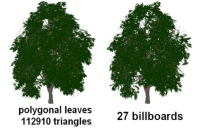

## Industry advanced product development

<pre>
I'm a staff engineer in <a href="https://www.arm.com/">Arm</a>'s Machine Learning Group working
with David Mansell and <a href="https://www.linkedin.com/in/ianbratt" title="Ian Bratt">Ian Bratt</a>.

My current work involves analysing neural networks of future use-cases, 
identifying the most relevant operations and data patterns, 
capturing key insights with data science techniques to advance 
real-world performance future <a href="https://www.arm.com">Arm</a>'s new software and hardware 
solutions.

Between 2016-2017 I worked in <a href="https://www.arm.com/">Arm</a>'s Architecture and Technology 
Group, as member of the Intelligent Machines Future System Design 
team, working with <a href="https://uk.linkedin.com/in/paulshughes">Paul Hughes</a> analysing and prototyping 
computer vision and ML subsystems for ADAS.

In 2012 I joined <a href="https://www.arm.com/">Arm</a>'s Processor Division working in system architecture 
and heterogeneous computing projects with <a href="https://uk.linkedin.com/in/charles-garc%C3%ADa-tobin-0374071">Charles Garcia-Tobin</a> 
and <a href="https://www.linkedin.com/in/jason-parker-1548aa1/">Jason Parker</a>.
</pre>

## Academic research
<pre>
I have a Ph. D. in Computer Science from <a href="https://www.udg.edu/en/?_ga=2.210128597.1782169398.1547342987-753952721.1547342987">University of Girona</a>.

My research concerned with parallel efficient data structures for data 
visualization, geometric modeling, image-based data structures
and ray-tracing. 

My work explored practical applications in a variety of areas in computer 
graphics, including real-time tree rendering, GPU efficient 
data-structures for geometric and texturing, and more recently 
dynamic parallel data-structures for ray-tracing and general-purpose 
GPU applications.

In 2011 I did a doctorate research internship in <a href="http://alice.loria.fr">ALICE Project-Team</a>
(INRIA Nancy), collaborating with <a href="http://www.antexel.com/sylefeb/research">Dr. Sylvain Lefebrve</a>.

In 2007 I started my Phd. in Computer Graphics joining the 
<a href="http://ggg.udg.edu/">GGG research group</a>, under the supervision of <a href="http://ima.udg.edu/~dagush/">Dr. Gustavo Patow</a>.

In 2005 I did a research internship at Technical University of Budapest
<a href="">Computer Graphics Research Group</a> collaborating with 
<a href="http://www.fsz.bme.hu/~szirmay/szirmay.html">Prof. Laszlo Szirmay-Kalos</a>.

I was introduced in the Computer Graphics field advised 
by <a href="http://ima.udg.edu/~mateu/">Prof. Mateu Sbert</a>.
</pre>

## Selected industry projects

### Automotive ADAS subsystems and use-cases

Modeling and prototyping 

### Exploring new AArch64 ISA extensions (SVE)

Prototyping and analysing the impact of new <a href="https://community.arm.com/tools/hpc/b/hpc/posts/technology-update-the-scalable-vector-extension-sve-for-the-armv8-a-architecture">SVE (Scalable Vector Extension)</a> instruction set in computer vision workloads.
Exploiting as much data-level parallelism as possible for new instructions vector lengths that scale from 128 to 2048 bits.

### GPU coherency and heterogeneous computing

Modelling, early protytiping low-level software, and analysing heterogeneous compute use-cases to explore <a href="https://community.arm.com/processors/b/blog/posts/exploring-how-cache-coherency-accelerates-heterogeneous-compute">Shared Virtual Memory (SVM)</a> features between different type of processors (CPU & GPU) enabling sharing data, as simply as passing a pointer, which massively simplifies the software, more power efficient and higher performance than software managed mechanism.

## Selected publications

#### Parallel spatial data structures for interactive rendering
{:width="128px"}

PhD Thesis, October 2012

#### Interactive Applications for Sketch-Based Editable Polycube Map
{:width="128px"}

IEEE Transactions on Visualization and Computer Graphics,  
(Volume:19, Issue: 7, July 2013)  
Ismael Garcia, Jiazhi Xia, Ying He, Shi-Qing Xin, Gustavo Patow  

#### A Runtime Cache for Interactive Procedural Modeling
{:width="128px"}

SMI 2012: Shape Modeling International, Computer & Graphics  
Tim Reiner, Sylvain Lefebvre, Lorenz Diener, Ismael Garcia, Bruno Jobard, Carsten Dachsbacher 

#### Coherent parallel hashing
{:width="128px"}

ACM Transactions on Graphics  
Proceedings of SIGGRAPH Asia, Vol. 30(6), 2011  
Ismael Garcia, Sylvain Lefebvre, Samuel Hornus, Anass Lasram  

#### Editable Polycube Map for GPU-based Subdivision Surfaces
{:width="128px"}

I3D 2011: Proceedings of Symposium on Interactive 3D Graphics &amp; Games
Jiazhi Xia, Ismael Garcia, Ying He, Shi-Qing Xin, Gustavo Patow  

#### IGT: Inverse Geometric Textures
{:width="128px"}

ACM Transactions on Graphics  
Proceedings of SIGGRAPH Asia, Vol. 27(5), 2008  
Ismael Garcia, Gustavo Patow  

#### Generation and interactive visualization of 3D vegetation
{:width="128px"}

Master thesis in Computing, 2007  
From the University of Girona and the UPC Barcelona Tech  
Advised by Gustavo Patow and Mateu Sbert

#### Multi-layered indirect texturing for tree rendering
{:width="128px"}

Eurographics Workshop on Natural Phenomena 2007  
Ismael Garcia, Gustavo Patow, Laszlo Szirmay-Kalos, Mateu Sbert, 

#### Tree rendering with billboard clouds
{:width="128px"}

Third Hungarian Conference on Computer Graphics and Geometry, 2005  
Ismael Garcia, Mateu Sbert, Laszlo Szirmay-Kalos  

#### Leaf cluster impostors for tree rendering with parallax
{:width="128px"}

Short Paper of Eurographics (Dublin, Ireland), pp. 69-72, 2005  
Ismael Garcia, Mateu Sbert, Laszlo Szirmay-Kalos  

## Academic teaching

#### From 2010 to 2011	Multimedia  and computing technologies,  
Technical Computer Engineering  (University  of Girona)  
Teaching assistant

#### From 2009 to 2010	Multimedia  and computing technologies,  
Technical Computer Engineering  (University  of Girona)  
Teaching assistant

#### From 2008 to 2009	Information Technologies,  
Enviromental Science (University  of Girona)  
Teaching assistant

#### From 2007 to 2008	Effective audio-visual presentations, 
Law (University of Girona)  
Teaching assistant

#### From 2007 to 2008	Information Technologies,  
Enviromental Science (University  of Girona)  
Teaching assistant

## Conference talks

<!-- #### 2019: Global Engineering Conference
Arm internal engineering conference -->
  
#### 2018: Data + Insights
Arm internal Data Science Conference
<!--  Improving ML solutions with Data Science --> 

#### 2011: Parallel computing for data processing, rendering & interaction
Univ. Barcelona, Event Lab, 4th November

#### 2011:	Coherent parallel hashing
SIGGRAPH Asia 2011  
Hong Kong, China  

#### 2011:       Editable Polycube Map for GPU-based Subdivision Surfaces
Symposium on Interactive 3D Graphics and Games 2011  
San Francisco, USA  
 
#### 2008:	IGT: Inverse Geometric Textures
SIGGRAPH Asia 2011  
Singapure, Singapore  

#### 2007:	Multi-layered indirect texturing for tree rendering
Eurographics Workshop on Natural Phenomena 2007  
Prague, Czech Republic  

#### 2005:	Leaf cluster impostors for tree rendering with parallax
Eurographics 2005  
Dublin, Ireland  

## Supervised Bachelor Students:

#### 2017    Gershom Akoli Agim
Deep Neural Networks on Arm Cortex-A CPUs  
Analysis of CPU Inference on Vision workloads  
MEng Electrical & Electronic Engineering Hons Project  
Heriot-Watt University

#### 2016    Jan-Peter Larsson 
3D Reconstruction using Stereo Matching Techniques on Scalable Vector Processors  
MEng Electrical Hons Project  
Edinburgh University 
 
#### 2011	Enrique Nuzete
Interactive polycubemap editor  
BEng Project, Technical Computer Engineering   
University of Girona  

#### 2011    Tania Mendes
Modelling and visualization of skeleton-based animations  
BEng Project, Technical Computer Engineering   
University of Girona  

#### 2007    Verena Skuk
Procedural modelling and rendering of vegetation  
Student Research Project  
University of Girona  

#### 2007    Isaac Moles
Real-time rendering of large forest  
BEng Project, Technical Computer Engineering   
University of Girona

## Other professional activities

### Program Committee Member	 
#### CGVCVIP  Computer  Graphics, Visualization, Computer  Vision &  Image Processing
2012
http://www.iadisportal.org/digital-library/iadis-international-conference-computer-graphics-visualization-computer-vision-and-image-processing-2012-part-of-mccsis-2012

#### CEIG: 
2015 http://ceig2015.uji.es

### Reviewer
 
#### Siggraph Asia: 
<a href="https://sa2014.siggraph.org/en">Siggraph Asia 2014</a>  
Technical papers reviewer  
<a href="https://sa2015.siggraph.org/en">Siggraph Asia 2015</a>  
Technical papers reviewer  

#### CGI Computer Graphics International: 
<a href="https://blogs.bournemouth.ac.uk/cgi2012">CGI 2012</a>  
Technical papers reviewer  
 
#### I3D Interactive 3D Graphics and Games: 
<a href="https://i3dsymposium.github.io/2012">I3D 2012</a>  
Technical papers reviewer

#### EG Eurographics:
<a href="https://www.ics.forth.gr/eg2008/home.php">EG 2008</a>  
Technical papers reviewer  

<a href="http://eg2013.udg.edu">EG 2013</a>    
Technical papers reviewer  

#### Computer Animation and Virtual Worlds Journal: 
2014 https://onlinelibrary.wiley.com/journal/1546427x  

#### CEIG Congreso Español de Informática Gráfica:
2015 http://ceig2015.uji.es  
2009 https://dblp.org/db/conf/ceig/ceig2009.html  
2008 http://www.lsi.upc.edu/events/ceig  

### Conference Organizer	
2009 Eurographics Symposium on Rendering, EGSR
http://iiia.udg.edu/EGSR2009/
Girona, Spain
Local organizer

### Industry research collaborations	
NVIDIA Mutual Non-Disclosure Agreement NVIDIA GPU Mesh Processing tools

## Education and training

#### 2007 – 2012	Ph.D. in Computer  Science
Dissertation: Parallel spatial data structures for interactive rendering.
BR PhD Fellowship from the University of Girona

#### 2006 – 2007	Master in computing
From the University of Girona, and the UPC Barcelona Tech

#### 2003 – 2006	Computer Engineering
University of Girona, (Spain)

#### 1999 – 2003	Technical Computer Engineering 
University of Girona, (Spain)

## Honors and awards
 
#### 2007	Generation and real-time visualization of 3D vegetation
Best UdG-CS project award 2006/2007
University of Girona
Patronat Award 12th Edition winner
Supervised by Gustavo Patow and Mateu Sbert

## Academic experience

#### From June 2011 to December 2013	Advances in virtual reality for cutting edge applications
Spanish Ministry of Science and Technology Project (TIN2010-20590-C02-02) 
Research developer, http://ggg.udg.edu/projectes/TIN2010/index.shtml

#### From November 2007 to July 2010	CALBaD. Computer Aided Light Based Design
Spanish Ministry of Science and Technology Project (TIN2007-67120)
Research developer, http://ggg.udg.edu/projectes/TIN2007-67120/
 
#### From October 2009 to December 2009	Research intership - INRIA Nancy (France), Alice project-team
Phd thesis research intership under supervision of Dr.Sylvain Lefebvre
(Mobility grant TME2008-00961) Research developer http://alice.loria.fr/

#### From May 2007 to May 2011	PhD research fellowship Universitat de Girona, 
(BR) Research PhD student, http://www.gametools.org

#### From September 2004 to April 2007	Gametools Project
European Union Project (IST-2-004363) Research developer, http://www.gametools.org

#### From February 2010 to April 2010	Research intership - INRIA Nancy (France), Alice project-team
Phd thesis research intership under supervision of Dr.Sylvain Lefebvre
(INRIA contract) Research developer, http://alice.loria.fr/

#### From February 2005 to May 2005	Research undergraduate intership - Technical University of Budapest Undergraduate final project under supervision of Prof.László Szirmay-Kalos (Erasmus programme grant).
Research developer
http://cg.iit.bme.hu/portal/en/publications/volume-visualization

<!--
## Conferences attendance

#### 2017 Implementing Machine Vision with FPGA and SoC platforms Conference
https://nmi.org.uk/event/fpga-network-implementing-machine-vision-with-fpga-and-soc-platforms/

#### 2018 Arm Research Summit
https://www.arm.com/company/events/research-summit

#### 2013 Global Engineering Conference
Arms global engineering conference

#### International Workshop on OpenCL, 
IWOCL 2013 https://www.iwocl.org/2013-presentations/
IWOCL 2014 https://www.iwocl.org/iwocl-2014/agenda-and-slides/
-->

## Previous experience

#### From June 2003 to March 2006	El Baúl S.A. – Grupo editorial el baúl
Web developer
Redesign and implementation  of a corporative application to the web management of adverts
http://www.elbaul.es

#### From July 2002 to December 2002	Institut d’Informàtica i Aplicacions, Universitat  de Girona
Software developer
Analysis and performance analysis of of the Sony’s Playstation 2 Linux Development Kit.
http://ima.udg.es/iiia/GGG/TIC2001-2416-C03-01/

#### From June 2000 to September 2000	Igm Web S.A.
Web developer
Design and implementation of several corporative websites.
http://www.igmweb.com/indexcat.html

#### From June 1999 to September 1999	Kripton Networks
Web technical writer
Writing technical reviews of videogames as a freelance web journalist.
http://www.iespana.es/area64/

